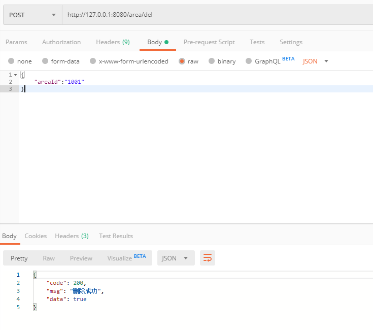

### area接口  

插入、修改使用同一接口，不存在则是添加，存在就是更新数据。

+ #### 1、添加（更新）area 

url:
```
http://127.0.0.1:8080/area/add
```
requestBody:
```
{
	"areaId":"1001",
    "area": "区",
    "cityId": "110100"
}
```
response:
```
{
    "code": 200,
    "msg": "添加成功",
    "data": true
}
```
Postman请求示例截图：  
  


+ #### 2、更新（添加）area  
数据库已存在相同areaId的数据，则更新  

url:
```
http://127.0.0.1:8080/area/add
```
requestBody:
```
{
	"areaId":"1001",
    "area": "area",
    "cityId": "110100"
}
```
response:
```
{
    "code": 200,
    "msg": "该Area已存在,更新成功",
    "data": true
}
```
Postman请求示例截图：  
  

+ #### 3、根据areaId删除area  

url:
```
http://127.0.0.1:8080/area/del
```
requestBody:
```
{
	"areaId":"1001"
}
```
response:
```
{
    "code": 200,
    "msg": "删除成功",
    "data": true
}
```
Postman请求示例截图：  
  

+ #### 4、根据id获取area列表  

url:
```
http://127.0.0.1:8080/area/listById
```
requestBody:
```
{
	"areaId":"1001"
}
```
response:
```
{
    "code": 200,
    "msg": "查询成功",
    "data": [
        {
            "id": 3145,
            "areaId": "1001",
            "area": "area",
            "cityId": "110100"
        }
    ]
}
```  
Postman请求示例截图：  


+ #### 5、获取所有area列表  

url:
```
http://127.0.0.1:8080/area/list
```
requestBody:
```
{
	"pageNum":1,
	"pageSize":5
}
```
response:
```
{
    "code": 200,
    "msg": "查询成功",
    "data": [
        {
            "id": 1,
            "areaId": "110101",
            "area": "东城区",
            "cityId": "110100"
        },
        {
            "id": 2,
            "areaId": "110102",
            "area": "西城区",
            "cityId": "110100"
        },
        {
            "id": 3,
            "areaId": "110103",
            "area": "崇文区",
            "cityId": "110100"
        },
        {
            "id": 4,
            "areaId": "110104",
            "area": "宣武区",
            "cityId": "110100"
        },
        {
            "id": 5,
            "areaId": "110105",
            "area": "朝阳区",
            "cityId": "110100"
        }
    ]
}
```  
Postman请求示例截图：  
