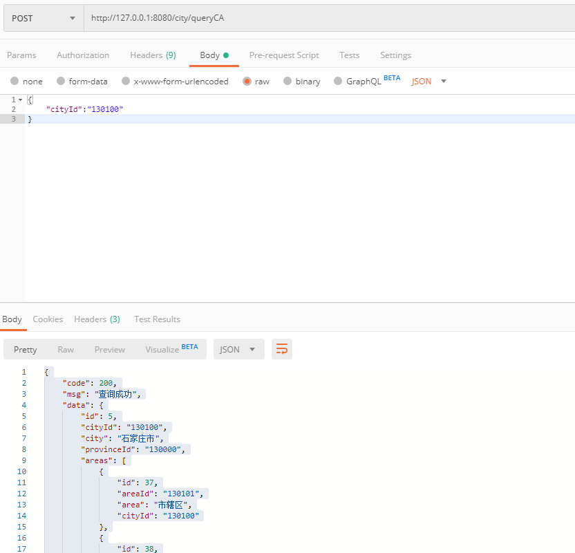

### city接口  

插入、修改使用同一接口，不存在则是添加，存在就是更新数据。

+ #### 1、添加（更新）city 

url:
```
http://127.0.0.1:8080/city/add
```
requestBody:
```
{
	"cityId": "1001",
    "city": "城市",
    "provinceId": "110000"
}
```
response:
```
{
    "code": 200,
    "msg": "添加成功",
    "data": true
}
```
Postman请求示例截图：  
  


+ #### 2、更新（添加）city  
数据库已存在相同cityId的数据，则更新  

url:
```
http://127.0.0.1:8080/city/add
```
requestBody:
```
{
	"cityId": "1001",
    "city": "城市",
    "provinceId": "110000"
}
```
response:
```
{
    "code": 200,
    "msg": "该City已存在,更新成功",
    "data": true
}
```
Postman请求示例截图：  
  

+ #### 3、根据cityId删除city  

url:
```
http://127.0.0.1:8080/city/del
```
requestBody:
```
{
	"cityId": "1001"
}
```
response:
```
{
    "code": 200,
    "msg": "删除成功",
    "data": true
}
```
Postman请求示例截图：  
  

+ #### 4、根据id获取city  
市区已做好联合查询，市的字段中有区的集合  
url:
```
http://127.0.0.1:8080/city/queryCA
```
requestBody:
```
{
	"cityId":"130100"
}
```
response:
```
{
    "code": 200,
    "msg": "查询成功",
    "data": {
        "id": 5,
        "cityId": "130100",
        "city": "石家庄市",
        "provinceId": "130000",
        "areas": [
            {
                "id": 37,
                "areaId": "130101",
                "area": "市辖区",
                "cityId": "130100"
            },
            {
                "id": 38,
                "areaId": "130102",
                "area": "长安区",
                "cityId": "130100"
            },
            {
                "id": 39,
                "areaId": "130103",
                "area": "桥东区",
                "cityId": "130100"
            },
            {
                "id": 40,
                "areaId": "130104",
                "area": "桥西区",
                "cityId": "130100"
            },
            {
                "id": 41,
                "areaId": "130105",
                "area": "新华区",
                "cityId": "130100"
            },
            {
                "id": 42,
                "areaId": "130107",
                "area": "井陉矿区",
                "cityId": "130100"
            },
            {
                "id": 43,
                "areaId": "130108",
                "area": "裕华区",
                "cityId": "130100"
            },
            {
                "id": 44,
                "areaId": "130121",
                "area": "井陉县",
                "cityId": "130100"
            },
            {
                "id": 45,
                "areaId": "130123",
                "area": "正定县",
                "cityId": "130100"
            },
            {
                "id": 46,
                "areaId": "130124",
                "area": "栾城县",
                "cityId": "130100"
            },
            {
                "id": 47,
                "areaId": "130125",
                "area": "行唐县",
                "cityId": "130100"
            },
            {
                "id": 48,
                "areaId": "130126",
                "area": "灵寿县",
                "cityId": "130100"
            },
            {
                "id": 49,
                "areaId": "130127",
                "area": "高邑县",
                "cityId": "130100"
            },
            {
                "id": 50,
                "areaId": "130128",
                "area": "深泽县",
                "cityId": "130100"
            },
            {
                "id": 51,
                "areaId": "130129",
                "area": "赞皇县",
                "cityId": "130100"
            },
            {
                "id": 52,
                "areaId": "130130",
                "area": "无极县",
                "cityId": "130100"
            },
            {
                "id": 53,
                "areaId": "130131",
                "area": "平山县",
                "cityId": "130100"
            },
            {
                "id": 54,
                "areaId": "130132",
                "area": "元氏县",
                "cityId": "130100"
            },
            {
                "id": 55,
                "areaId": "130133",
                "area": "赵　县",
                "cityId": "130100"
            },
            {
                "id": 56,
                "areaId": "130181",
                "area": "辛集市",
                "cityId": "130100"
            },
            {
                "id": 57,
                "areaId": "130182",
                "area": "藁城市",
                "cityId": "130100"
            },
            {
                "id": 58,
                "areaId": "130183",
                "area": "晋州市",
                "cityId": "130100"
            },
            {
                "id": 59,
                "areaId": "130184",
                "area": "新乐市",
                "cityId": "130100"
            },
            {
                "id": 60,
                "areaId": "130185",
                "area": "鹿泉市",
                "cityId": "130100"
            }
        ]
    }
}
```  
Postman请求示例截图：  


+ #### 5、获取所有city列表  
市区已做好联合查询，市的字段中有区的集合  
url:
```
http://127.0.0.1:8080/city/list
```
requestBody:
```
{
	"pageNum":1,
	"pageSize":5
}
```
response:
```
{
    "code": 200,
    "msg": "查询成功",
    "data": [
        {
            "id": 1,
            "cityId": "110100",
            "city": "北京市",
            "provinceId": "110000",
            "areas": [
                {
                    "id": 1,
                    "areaId": "110101",
                    "area": "东城区",
                    "cityId": "110100"
                },
                {
                    "id": 2,
                    "areaId": "110102",
                    "area": "西城区",
                    "cityId": "110100"
                },
                {
                    "id": 3,
                    "areaId": "110103",
                    "area": "崇文区",
                    "cityId": "110100"
                },
                {
                    "id": 4,
                    "areaId": "110104",
                    "area": "宣武区",
                    "cityId": "110100"
                },
                {
                    "id": 5,
                    "areaId": "110105",
                    "area": "朝阳区",
                    "cityId": "110100"
                },
                {
                    "id": 6,
                    "areaId": "110106",
                    "area": "丰台区",
                    "cityId": "110100"
                },
                {
                    "id": 7,
                    "areaId": "110107",
                    "area": "石景山区",
                    "cityId": "110100"
                },
                {
                    "id": 8,
                    "areaId": "110108",
                    "area": "海淀区",
                    "cityId": "110100"
                },
                {
                    "id": 9,
                    "areaId": "110109",
                    "area": "门头沟区",
                    "cityId": "110100"
                },
                {
                    "id": 10,
                    "areaId": "110111",
                    "area": "房山区",
                    "cityId": "110100"
                },
                {
                    "id": 11,
                    "areaId": "110112",
                    "area": "通州区",
                    "cityId": "110100"
                },
                {
                    "id": 12,
                    "areaId": "110113",
                    "area": "顺义区",
                    "cityId": "110100"
                },
                {
                    "id": 13,
                    "areaId": "110114",
                    "area": "昌平区",
                    "cityId": "110100"
                },
                {
                    "id": 14,
                    "areaId": "110115",
                    "area": "大兴区",
                    "cityId": "110100"
                },
                {
                    "id": 15,
                    "areaId": "110116",
                    "area": "怀柔区",
                    "cityId": "110100"
                },
                {
                    "id": 16,
                    "areaId": "110117",
                    "area": "平谷区",
                    "cityId": "110100"
                },
                {
                    "id": 17,
                    "areaId": "110228",
                    "area": "密云县",
                    "cityId": "110100"
                },
                {
                    "id": 18,
                    "areaId": "110229",
                    "area": "延庆县",
                    "cityId": "110100"
                }
            ]
        },
        {
            "id": 2,
            "cityId": "1102xx",
            "city": "北京下属县",
            "provinceId": "1100xx",
            "areas": []
        },
        {
            "id": 3,
            "cityId": "120100",
            "city": "天津市",
            "provinceId": "120000",
            "areas": [
                {
                    "id": 19,
                    "areaId": "120101",
                    "area": "和平区",
                    "cityId": "120100"
                },
                {
                    "id": 20,
                    "areaId": "120102",
                    "area": "河东区",
                    "cityId": "120100"
                },
                {
                    "id": 21,
                    "areaId": "120103",
                    "area": "河西区",
                    "cityId": "120100"
                },
                {
                    "id": 22,
                    "areaId": "120104",
                    "area": "南开区",
                    "cityId": "120100"
                },
                {
                    "id": 23,
                    "areaId": "120105",
                    "area": "河北区",
                    "cityId": "120100"
                },
                {
                    "id": 24,
                    "areaId": "120106",
                    "area": "红桥区",
                    "cityId": "120100"
                },
                {
                    "id": 25,
                    "areaId": "120107",
                    "area": "塘沽区",
                    "cityId": "120100"
                },
                {
                    "id": 26,
                    "areaId": "120108",
                    "area": "汉沽区",
                    "cityId": "120100"
                },
                {
                    "id": 27,
                    "areaId": "120109",
                    "area": "大港区",
                    "cityId": "120100"
                },
                {
                    "id": 28,
                    "areaId": "120110",
                    "area": "东丽区",
                    "cityId": "120100"
                },
                {
                    "id": 29,
                    "areaId": "120111",
                    "area": "西青区",
                    "cityId": "120100"
                },
                {
                    "id": 30,
                    "areaId": "120112",
                    "area": "津南区",
                    "cityId": "120100"
                },
                {
                    "id": 31,
                    "areaId": "120113",
                    "area": "北辰区",
                    "cityId": "120100"
                },
                {
                    "id": 32,
                    "areaId": "120114",
                    "area": "武清区",
                    "cityId": "120100"
                },
                {
                    "id": 33,
                    "areaId": "120115",
                    "area": "宝坻区",
                    "cityId": "120100"
                },
                {
                    "id": 34,
                    "areaId": "120221",
                    "area": "宁河县",
                    "cityId": "120100"
                },
                {
                    "id": 35,
                    "areaId": "120223",
                    "area": "静海县",
                    "cityId": "120100"
                },
                {
                    "id": 36,
                    "areaId": "120225",
                    "area": "蓟　县",
                    "cityId": "120100"
                }
            ]
        },
        {
            "id": 4,
            "cityId": "1202xx",
            "city": "天津下属县",
            "provinceId": "1200xx",
            "areas": []
        },
        {
            "id": 5,
            "cityId": "130100",
            "city": "石家庄市",
            "provinceId": "130000",
            "areas": [
                {
                    "id": 37,
                    "areaId": "130101",
                    "area": "市辖区",
                    "cityId": "130100"
                },
                {
                    "id": 38,
                    "areaId": "130102",
                    "area": "长安区",
                    "cityId": "130100"
                },
                {
                    "id": 39,
                    "areaId": "130103",
                    "area": "桥东区",
                    "cityId": "130100"
                },
                {
                    "id": 40,
                    "areaId": "130104",
                    "area": "桥西区",
                    "cityId": "130100"
                },
                {
                    "id": 41,
                    "areaId": "130105",
                    "area": "新华区",
                    "cityId": "130100"
                },
                {
                    "id": 42,
                    "areaId": "130107",
                    "area": "井陉矿区",
                    "cityId": "130100"
                },
                {
                    "id": 43,
                    "areaId": "130108",
                    "area": "裕华区",
                    "cityId": "130100"
                },
                {
                    "id": 44,
                    "areaId": "130121",
                    "area": "井陉县",
                    "cityId": "130100"
                },
                {
                    "id": 45,
                    "areaId": "130123",
                    "area": "正定县",
                    "cityId": "130100"
                },
                {
                    "id": 46,
                    "areaId": "130124",
                    "area": "栾城县",
                    "cityId": "130100"
                },
                {
                    "id": 47,
                    "areaId": "130125",
                    "area": "行唐县",
                    "cityId": "130100"
                },
                {
                    "id": 48,
                    "areaId": "130126",
                    "area": "灵寿县",
                    "cityId": "130100"
                },
                {
                    "id": 49,
                    "areaId": "130127",
                    "area": "高邑县",
                    "cityId": "130100"
                },
                {
                    "id": 50,
                    "areaId": "130128",
                    "area": "深泽县",
                    "cityId": "130100"
                },
                {
                    "id": 51,
                    "areaId": "130129",
                    "area": "赞皇县",
                    "cityId": "130100"
                },
                {
                    "id": 52,
                    "areaId": "130130",
                    "area": "无极县",
                    "cityId": "130100"
                },
                {
                    "id": 53,
                    "areaId": "130131",
                    "area": "平山县",
                    "cityId": "130100"
                },
                {
                    "id": 54,
                    "areaId": "130132",
                    "area": "元氏县",
                    "cityId": "130100"
                },
                {
                    "id": 55,
                    "areaId": "130133",
                    "area": "赵　县",
                    "cityId": "130100"
                },
                {
                    "id": 56,
                    "areaId": "130181",
                    "area": "辛集市",
                    "cityId": "130100"
                },
                {
                    "id": 57,
                    "areaId": "130182",
                    "area": "藁城市",
                    "cityId": "130100"
                },
                {
                    "id": 58,
                    "areaId": "130183",
                    "area": "晋州市",
                    "cityId": "130100"
                },
                {
                    "id": 59,
                    "areaId": "130184",
                    "area": "新乐市",
                    "cityId": "130100"
                },
                {
                    "id": 60,
                    "areaId": "130185",
                    "area": "鹿泉市",
                    "cityId": "130100"
                }
            ]
        }
    ]
}
```  
Postman请求示例截图：  
