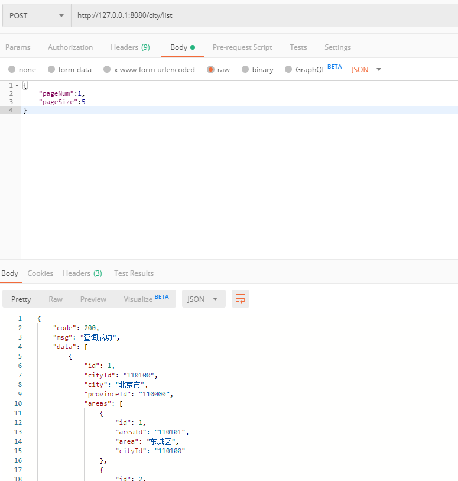

### city接口  

插入、修改使用同一接口，不存在则是添加，存在就是更新数据。

+ #### 1、添加（更新）city 

url:
```
http://127.0.0.1:8080/city/add
```
requestBody:
```
{
	"cityId": "1001",
    "city": "城市",
    "provinceId": "110000"
}
```
response:
```
{
    "code": 200,
    "msg": "添加成功",
    "data": true
}
```
Postman请求示例截图：  
  


+ #### 2、更新（添加）city  
数据库已存在相同cityId的数据，则更新  

url:
```
http://127.0.0.1:8080/city/add
```
requestBody:
```
{
	"cityId": "1001",
    "city": "城市",
    "provinceId": "110000"
}
```
response:
```
{
    "code": 200,
    "msg": "该City已存在,更新成功",
    "data": true
}
```
Postman请求示例截图：  
  

+ #### 3、根据cityId删除city  

url:
```
http://127.0.0.1:8080/city/del
```
requestBody:
```
{
	"cityId": "1001"
}
```
response:
```
{
    "code": 200,
    "msg": "删除成功",
    "data": true
}
```
Postman请求示例截图：  
  

+ #### 4、根据id获取city列表  

url:
```
http://127.0.0.1:8080/city/listById
```
requestBody:
```
{
	"cityId":"1001"
}
```
response:
```
{
    "code": 200,
    "msg": "查询成功",
    "data": [
        {
            "id": 347,
            "cityId": "1001",
            "city": "城市",
            "provinceId": "110000"
        }
    ]
}
```  
Postman请求示例截图：  


+ #### 5、获取所有city列表  

url:
```
http://127.0.0.1:8080/city/list
```
requestBody:
```
{
	"pageNum":1,
	"pageSize":5
}
```
response:
```
{
    "code": 200,
    "msg": "查询成功",
    "data": [
        {
            "id": 1,
            "cityId": "110100",
            "city": "北京市",
            "provinceId": "110000"
        },
        {
            "id": 2,
            "cityId": "1102xx",
            "city": "北京下属县",
            "provinceId": "1100xx"
        },
        {
            "id": 3,
            "cityId": "120100",
            "city": "天津市",
            "provinceId": "120000"
        },
        {
            "id": 4,
            "cityId": "1202xx",
            "city": "天津下属县",
            "provinceId": "1200xx"
        },
        {
            "id": 5,
            "cityId": "130100",
            "city": "石家庄市",
            "provinceId": "130000"
        }
    ]
}
```  
Postman请求示例截图：  
