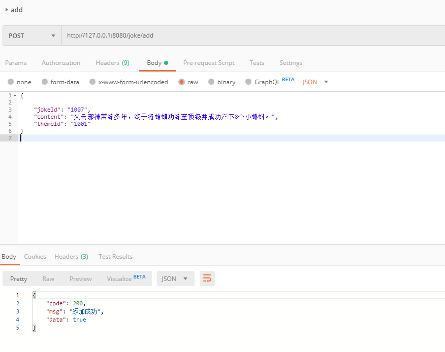
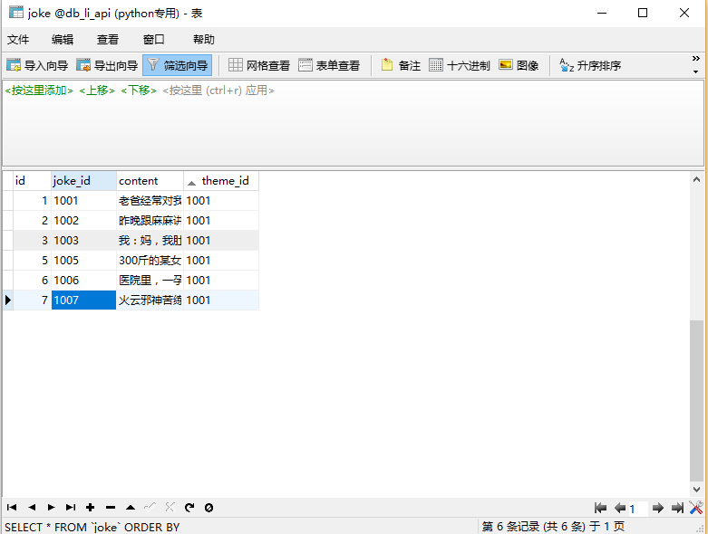
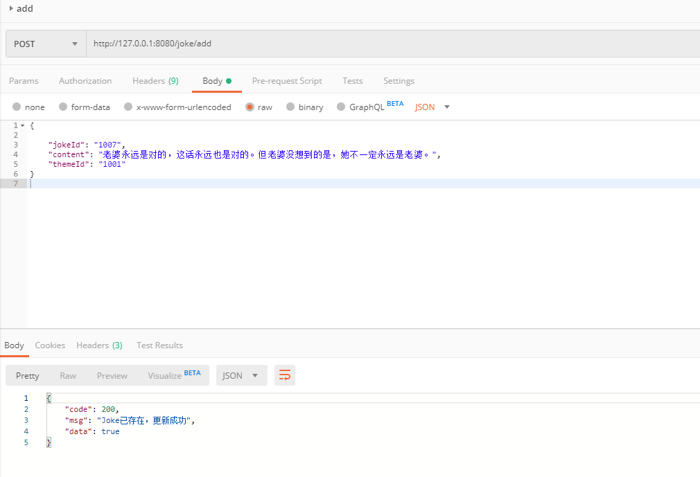
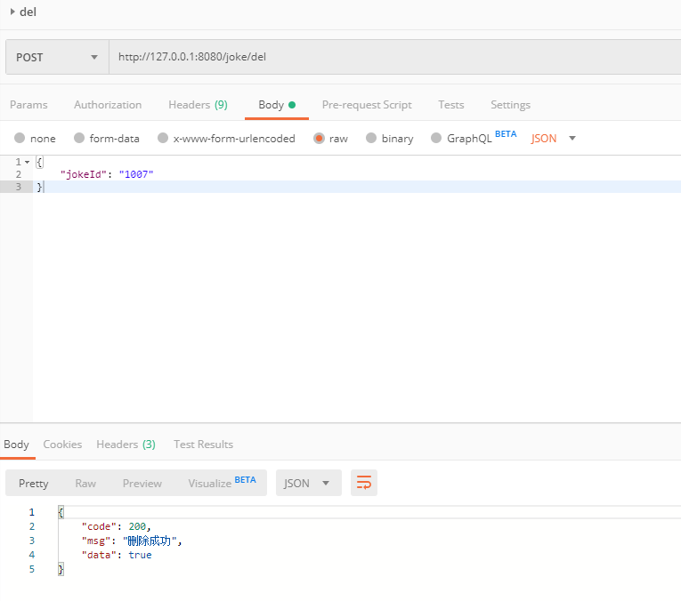
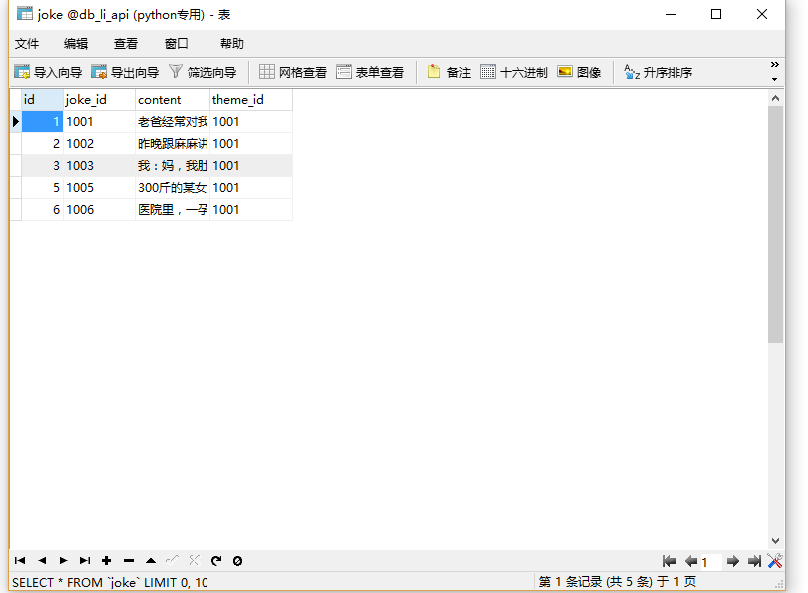
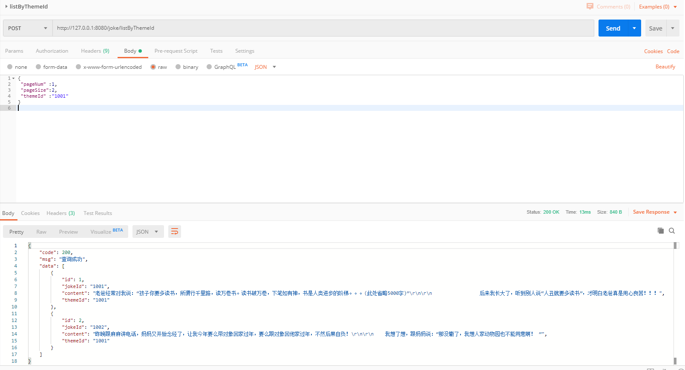
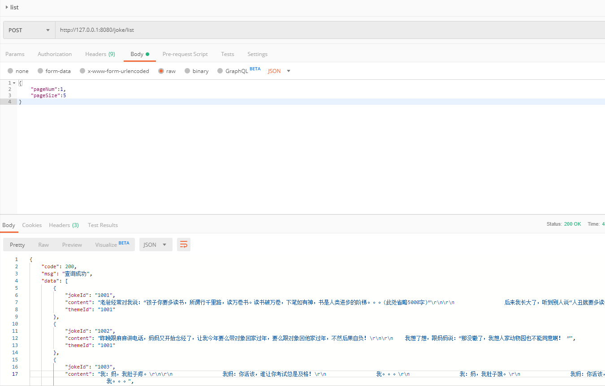

### joke接口  

插入、修改使用同一接口，不存在则是添加，存在就是更新数据。

+ #### 1、添加（更新）joke 

url:
```
http://127.0.0.1:8080/joke/add
```
requestBody:
```
{
    "jokeId": "1007",
    "content": "火云邪神苦练多年，终于将蛤蟆功练至顶级并成功产下8个小蝌蚪。",
    "themeId": "1001"
}
```
response:
```
{
    "code": 200,
    "msg": "添加成功",
    "data": true
}
```
Postman请求示例截图：  
  
数据库截图：  



+ #### 2、更新（添加）joke  
数据库已存在相同jokeId的数据，则更新  

url:
```
http://127.0.0.1:8080/joke/add
```
requestBody:
```
{
    "jokeId": "1007",
    "content": "老婆永远是对的，这话永远也是对的。但老婆没想到的是，她不一定永远是老婆。",
    "themeId": "1001"
}
```
response:
```
{
    "code": 200,
    "msg": "Joke已存在，更新成功",
    "data": true
}
```
Postman请求示例截图：  
  
数据库截图：  


+ #### 3、根据jokeId删除joke  

url:
```
http://127.0.0.1:8080/joke/del
```
requestBody:
```
{
    "jokeId": "1007"
}
```
response:
```
{
    "code": 200,
    "msg": "删除成功",
    "data": true
}
```
Postman请求示例截图：  
  
数据库截图：  


+ #### 4、根据themeId获取joke列表  

url:
```
http://127.0.0.1:8080/joke/listByThemeId
```
requestBody:
```
{
	"pageNum":1,
	"pageSize":2,
	"themeId":"1001"
}
```
response:
```
{
    "code": 200,
    "msg": "查询成功",
    "data": [
        {
            "id": 1,
            "jokeId": "1001",
            "content": "老爸经常对我说：“孩子你要多读书，所谓行千里路，读万卷书。读书破万卷，下笔如有神，书是人类进步的阶梯。。。(此处省略5000字)”\r\n\r\n                 后来我长大了，听到别人说“人丑就要多读书”，才明白老爸真是用心良苦！！！",
            "themeId": "1001"
        },
        {
            "id": 2,
            "jokeId": "1002",
            "content": "昨晚跟麻麻讲电话，妈妈又开始念经了，让我今年要么带对象回家过年，要么跟对象回他家过年，不然后果自负！\r\n\r\n    我想了想，跟妈妈说：“那没辙了，我想人家动物园也不能同意啊！ ”",
            "themeId": "1001"
        }
    ]
}
```
Postman请求示例截图：  


+ #### 5、获取所有joke列表  

url:
```
http://127.0.0.1:8080/joke/list
```
requestBody:
```
{
	"pageNum":1,
	"pageSize":5
}
```
response:
```
{
    "code": 200,
    "msg": "查询成功",
    "data": [
        {
            "jokeId": "1001",
            "content": "老爸经常对我说：“孩子你要多读书，所谓行千里路，读万卷书。读书破万卷，下笔如有神，书是人类进步的阶梯。。。(此处省略5000字)”\r\n\r\n                 后来我长大了，听到别人说“人丑就要多读书”，才明白老爸真是用心良苦！！！",
            "themeId": "1001"
        },
        {
            "jokeId": "1002",
            "content": "昨晚跟麻麻讲电话，妈妈又开始念经了，让我今年要么带对象回家过年，要么跟对象回他家过年，不然后果自负！\r\n\r\n    我想了想，跟妈妈说：“那没辙了，我想人家动物园也不能同意啊！ ”",
            "themeId": "1001"
        },
        {
            "jokeId": "1003",
            "content": "我：妈，我肚子疼。\r\n\r\n                 我妈：你活该，谁让你考试总是及格！\r\n                 我。。。\r\n                 我：妈，我肚子饿。\r\n                 我妈：你活该，谁让你快30了还没女朋友！\r\n                 我。。。",
            "themeId": "1001"
        }
    ]
}
```  
Postman请求示例截图：  
