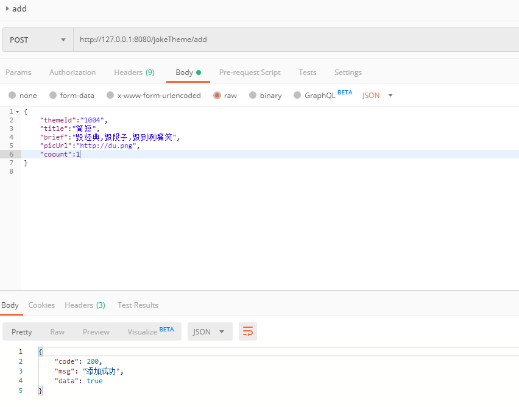
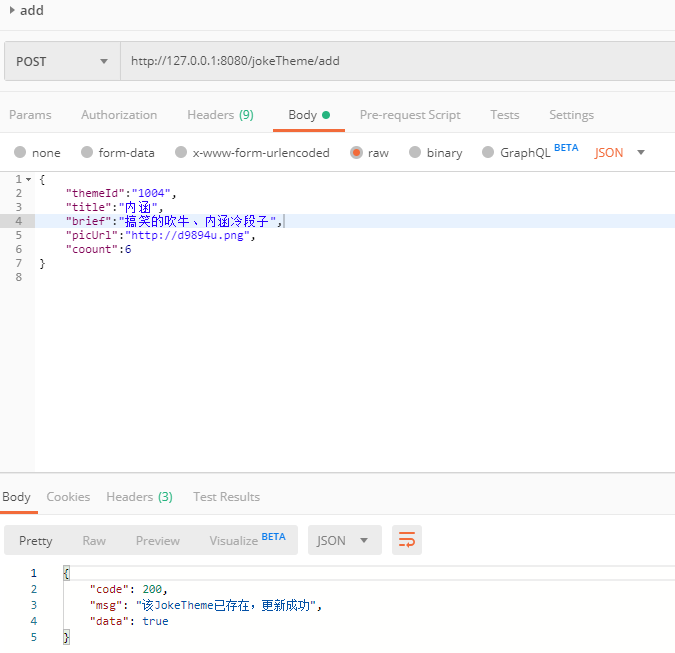
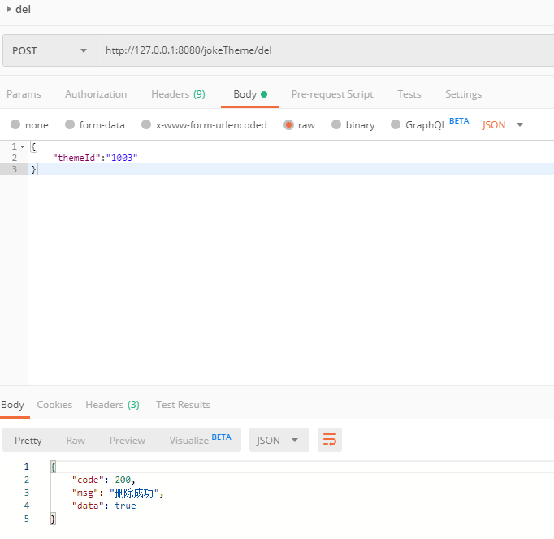
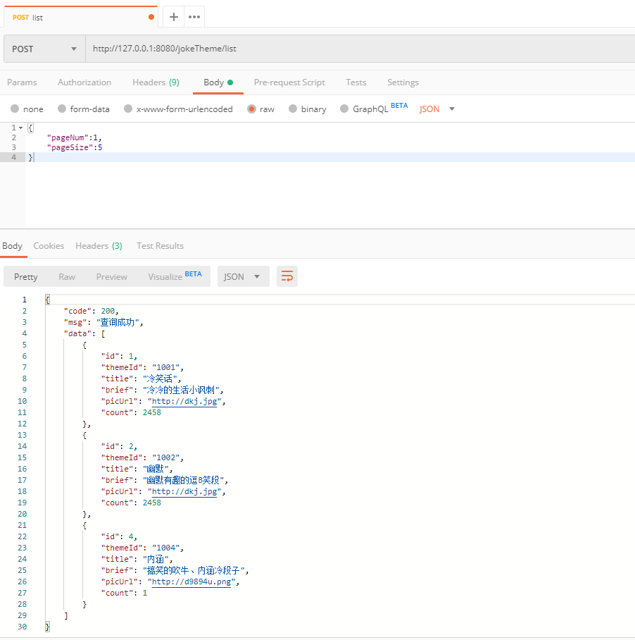

### jokeTheme接口  

插入、修改使用同一接口，不存在则是添加，存在就是更新数据。

+ #### 1、添加（更新）jokeTheme 

url:
```
http://127.0.0.1:8080/jokeTheme/add
```
requestBody:
```
{
    "themeId":"1004",
    "title":"简短",
	"brief":"毁经典,毁段子,毁到咧嘴笑",
	"picUrl":"http://du.png",
	"coount":1
}
```
response:
```
{
    "code": 200,
    "msg": "添加成功",
    "data": true
}
```
Postman请求示例截图：  
  


+ #### 2、更新（添加）jokeTheme  
数据库已存在相同jokeThemeId的数据，则更新  

url:
```
http://127.0.0.1:8080/jokeTheme/add
```
requestBody:
```
{
    "themeId":"1004",
    "title":"内涵",
	"brief":"搞笑的吹牛、内涵冷段子",
	"picUrl":"http://d9894u.png",
	"coount":6
}
```
response:
```
{
    "code": 200,
    "msg": "该JokeTheme已存在，更新成功",
    "data": true
}
```
Postman请求示例截图：  
  

+ #### 3、根据themeId删除jokeTheme  

url:
```
http://127.0.0.1:8080/jokeTheme/del
```
requestBody:
```
{
	"themeId":"1003"
}
```
response:
```
{
    "code": 200,
    "msg": "删除成功",
    "data": true
}
```
Postman请求示例截图：  
  

+ #### 4、获取所有jokeTheme列表  

url:
```
http://127.0.0.1:8080/jokeTheme/list
```
requestBody:
```
{
	"pageNum":1,
	"pageSize":5
}
```
response:
```
{
    "code": 200,
    "msg": "查询成功",
    "data": [
        {
            "id": 1,
            "themeId": "1001",
            "title": "冷笑话",
            "brief": "冷冷的生活小讽刺",
            "picUrl": "http://dkj.jpg",
            "count": 2458
        },
        {
            "id": 2,
            "themeId": "1002",
            "title": "幽默",
            "brief": "幽默有趣的逗B笑段",
            "picUrl": "http://dkj.jpg",
            "count": 2458
        },
        {
            "id": 4,
            "themeId": "1004",
            "title": "内涵",
            "brief": "搞笑的吹牛、内涵冷段子",
            "picUrl": "http://d9894u.png",
            "count": 1
        }
    ]
}
```  
Postman请求示例截图：  
