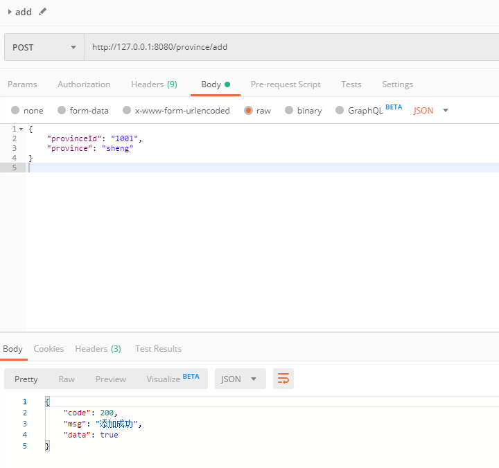
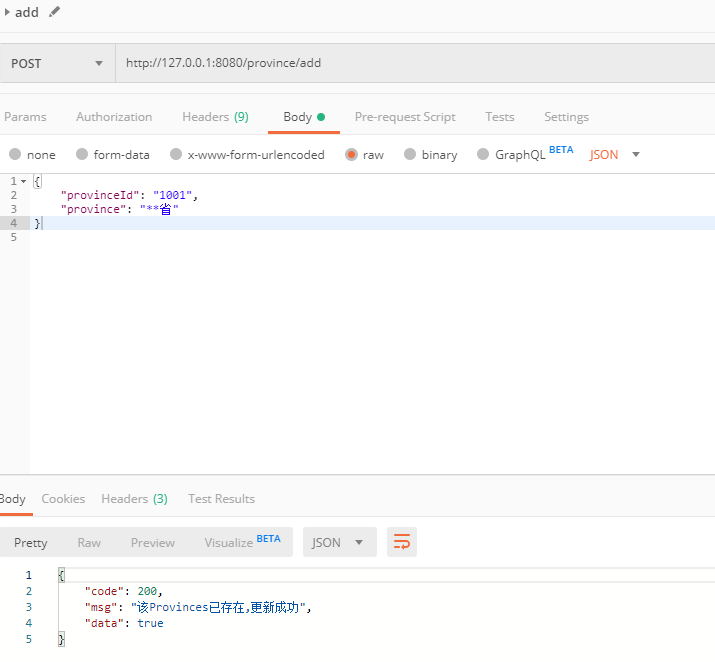
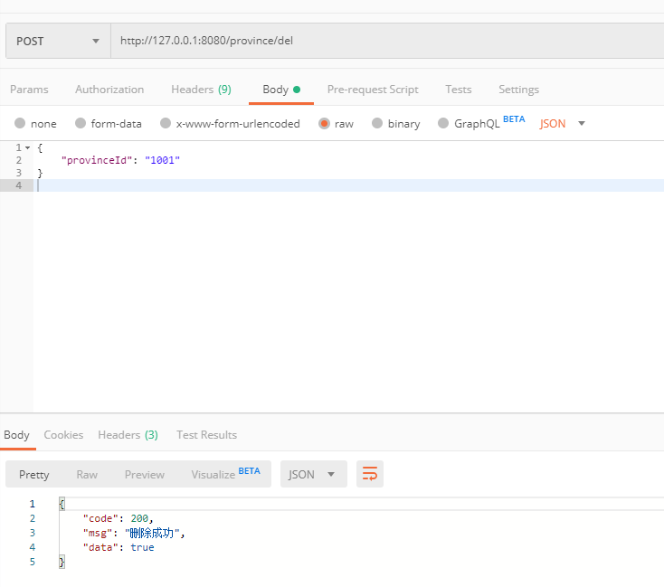
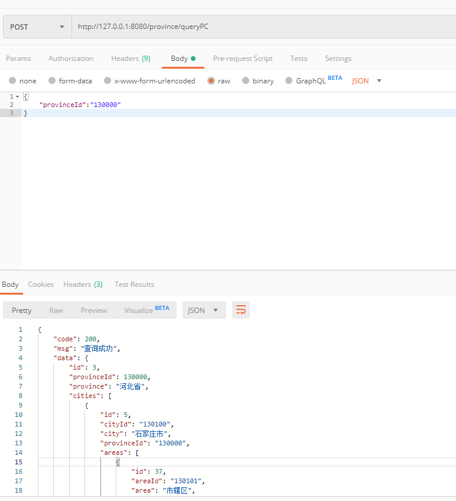
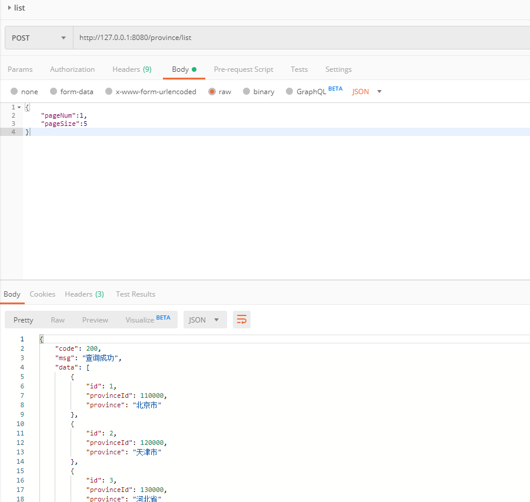

### province接口  

省市区是三级联动的，插入、修改使用同一接口，不存在则是添加，存在就是更新数据。

+ #### 1、添加（更新）province 

url:
```
http://127.0.0.1:8080/province/add
```
requestBody:
```
{
    "provinceId": "1001",
    "province": "sheng"
}
```
response:
```
{
    "code": 200,
    "msg": "添加成功",
    "data": true
}
```
Postman请求示例截图：  
  


+ #### 2、更新（添加）province  
数据库已存在相同provinceId的数据，则更新  

url:
```
http://127.0.0.1:8080/province/add
```
requestBody:
```
{
    "provinceId": "1001",
    "province": "**省"
}
```
response:
```
{
    "code": 200,
    "msg": "该Provinces已存在,更新成功",
    "data": true
}
```
Postman请求示例截图：  
  

+ #### 3、根据provinceId删除province  

url:
```
http://127.0.0.1:8080/province/del
```
requestBody:
```
{
    "provinceId": "1001"
}
```
response:
```
{
    "code": 200,
    "msg": "删除成功",
    "data": true
}
```
Postman请求示例截图：  
  

+ #### 4、根据provinceId获取province  
省市区已做好联合查询，省的字段中有市的集合，市的字段中有区的集合  
url:
```
http://127.0.0.1:8080/province/queryPC
```
requestBody:
```
{
	"provinceId":"130000"
}
```
response:
```
{
    "code": 200,
    "msg": "查询成功",
    "data": {
        "id": 3,
        "provinceId": 130000,
        "province": "河北省",
        "cities": [
            {
                "id": 5,
                "cityId": "130100",
                "city": "石家庄市",
                "provinceId": "130000",
                "areas": [
                    {
                        "id": 37,
                        "areaId": "130101",
                        "area": "市辖区",
                        "cityId": "130100"
                    },
                    {
                        "id": 38,
                        "areaId": "130102",
                        "area": "长安区",
                        "cityId": "130100"
                    },
                    {
                        "id": 39,
                        "areaId": "130103",
                        "area": "桥东区",
                        "cityId": "130100"
                    },
                    {
                        "id": 40,
                        "areaId": "130104",
                        "area": "桥西区",
                        "cityId": "130100"
                    },
                    {
                        "id": 41,
                        "areaId": "130105",
                        "area": "新华区",
                        "cityId": "130100"
                    },
                    {
                        "id": 42,
                        "areaId": "130107",
                        "area": "井陉矿区",
                        "cityId": "130100"
                    },
                    {
                        "id": 43,
                        "areaId": "130108",
                        "area": "裕华区",
                        "cityId": "130100"
                    },
                    {
                        "id": 44,
                        "areaId": "130121",
                        "area": "井陉县",
                        "cityId": "130100"
                    },
                    {
                        "id": 45,
                        "areaId": "130123",
                        "area": "正定县",
                        "cityId": "130100"
                    },
                    {
                        "id": 46,
                        "areaId": "130124",
                        "area": "栾城县",
                        "cityId": "130100"
                    },
                    {
                        "id": 47,
                        "areaId": "130125",
                        "area": "行唐县",
                        "cityId": "130100"
                    },
                    {
                        "id": 48,
                        "areaId": "130126",
                        "area": "灵寿县",
                        "cityId": "130100"
                    },
                    {
                        "id": 49,
                        "areaId": "130127",
                        "area": "高邑县",
                        "cityId": "130100"
                    },
                    {
                        "id": 50,
                        "areaId": "130128",
                        "area": "深泽县",
                        "cityId": "130100"
                    },
                    {
                        "id": 51,
                        "areaId": "130129",
                        "area": "赞皇县",
                        "cityId": "130100"
                    },
                    {
                        "id": 52,
                        "areaId": "130130",
                        "area": "无极县",
                        "cityId": "130100"
                    },
                    {
                        "id": 53,
                        "areaId": "130131",
                        "area": "平山县",
                        "cityId": "130100"
                    },
                    {
                        "id": 54,
                        "areaId": "130132",
                        "area": "元氏县",
                        "cityId": "130100"
                    },
                    {
                        "id": 55,
                        "areaId": "130133",
                        "area": "赵　县",
                        "cityId": "130100"
                    },
                    {
                        "id": 56,
                        "areaId": "130181",
                        "area": "辛集市",
                        "cityId": "130100"
                    },
                    {
                        "id": 57,
                        "areaId": "130182",
                        "area": "藁城市",
                        "cityId": "130100"
                    },
                    {
                        "id": 58,
                        "areaId": "130183",
                        "area": "晋州市",
                        "cityId": "130100"
                    },
                    {
                        "id": 59,
                        "areaId": "130184",
                        "area": "新乐市",
                        "cityId": "130100"
                    },
                    {
                        "id": 60,
                        "areaId": "130185",
                        "area": "鹿泉市",
                        "cityId": "130100"
                    }
                ]
            },
            {
                "id": 6,
                "cityId": "130200",
                "city": "唐山市",
                "provinceId": "130000",
                "areas": [
                    {
                        "id": 61,
                        "areaId": "130201",
                        "area": "市辖区",
                        "cityId": "130200"
                    },
                    {
                        "id": 62,
                        "areaId": "130202",
                        "area": "路南区",
                        "cityId": "130200"
                    },
                    {
                        "id": 63,
                        "areaId": "130203",
                        "area": "路北区",
                        "cityId": "130200"
                    },
                    {
                        "id": 64,
                        "areaId": "130204",
                        "area": "古冶区",
                        "cityId": "130200"
                    },
                    {
                        "id": 65,
                        "areaId": "130205",
                        "area": "开平区",
                        "cityId": "130200"
                    },
                    {
                        "id": 66,
                        "areaId": "130207",
                        "area": "丰南区",
                        "cityId": "130200"
                    },
                    {
                        "id": 67,
                        "areaId": "130208",
                        "area": "丰润区",
                        "cityId": "130200"
                    },
                    {
                        "id": 68,
                        "areaId": "130223",
                        "area": "滦　县",
                        "cityId": "130200"
                    },
                    {
                        "id": 69,
                        "areaId": "130224",
                        "area": "滦南县",
                        "cityId": "130200"
                    },
                    {
                        "id": 70,
                        "areaId": "130225",
                        "area": "乐亭县",
                        "cityId": "130200"
                    },
                    {
                        "id": 71,
                        "areaId": "130227",
                        "area": "迁西县",
                        "cityId": "130200"
                    },
                    {
                        "id": 72,
                        "areaId": "130229",
                        "area": "玉田县",
                        "cityId": "130200"
                    },
                    {
                        "id": 73,
                        "areaId": "130230",
                        "area": "唐海县",
                        "cityId": "130200"
                    },
                    {
                        "id": 74,
                        "areaId": "130281",
                        "area": "遵化市",
                        "cityId": "130200"
                    },
                    {
                        "id": 75,
                        "areaId": "130283",
                        "area": "迁安市",
                        "cityId": "130200"
                    }
                ]
            },
            {
                "id": 7,
                "cityId": "130300",
                "city": "秦皇岛市",
                "provinceId": "130000",
                "areas": [
                    {
                        "id": 76,
                        "areaId": "130301",
                        "area": "市辖区",
                        "cityId": "130300"
                    },
                    {
                        "id": 77,
                        "areaId": "130302",
                        "area": "海港区",
                        "cityId": "130300"
                    },
                    {
                        "id": 78,
                        "areaId": "130303",
                        "area": "山海关区",
                        "cityId": "130300"
                    },
                    {
                        "id": 79,
                        "areaId": "130304",
                        "area": "北戴河区",
                        "cityId": "130300"
                    },
                    {
                        "id": 80,
                        "areaId": "130321",
                        "area": "青龙满族自治县",
                        "cityId": "130300"
                    },
                    {
                        "id": 81,
                        "areaId": "130322",
                        "area": "昌黎县",
                        "cityId": "130300"
                    },
                    {
                        "id": 82,
                        "areaId": "130323",
                        "area": "抚宁县",
                        "cityId": "130300"
                    },
                    {
                        "id": 83,
                        "areaId": "130324",
                        "area": "卢龙县",
                        "cityId": "130300"
                    }
                ]
            },
            {
                "id": 8,
                "cityId": "130400",
                "city": "邯郸市",
                "provinceId": "130000",
                "areas": [
                    {
                        "id": 84,
                        "areaId": "130401",
                        "area": "市辖区",
                        "cityId": "130400"
                    },
                    {
                        "id": 85,
                        "areaId": "130402",
                        "area": "邯山区",
                        "cityId": "130400"
                    },
                    {
                        "id": 86,
                        "areaId": "130403",
                        "area": "丛台区",
                        "cityId": "130400"
                    },
                    {
                        "id": 87,
                        "areaId": "130404",
                        "area": "复兴区",
                        "cityId": "130400"
                    },
                    {
                        "id": 88,
                        "areaId": "130406",
                        "area": "峰峰矿区",
                        "cityId": "130400"
                    },
                    {
                        "id": 89,
                        "areaId": "130421",
                        "area": "邯郸县",
                        "cityId": "130400"
                    },
                    {
                        "id": 90,
                        "areaId": "130423",
                        "area": "临漳县",
                        "cityId": "130400"
                    },
                    {
                        "id": 91,
                        "areaId": "130424",
                        "area": "成安县",
                        "cityId": "130400"
                    },
                    {
                        "id": 92,
                        "areaId": "130425",
                        "area": "大名县",
                        "cityId": "130400"
                    },
                    {
                        "id": 93,
                        "areaId": "130426",
                        "area": "涉　县",
                        "cityId": "130400"
                    },
                    {
                        "id": 94,
                        "areaId": "130427",
                        "area": "磁　县",
                        "cityId": "130400"
                    },
                    {
                        "id": 95,
                        "areaId": "130428",
                        "area": "肥乡县",
                        "cityId": "130400"
                    },
                    {
                        "id": 96,
                        "areaId": "130429",
                        "area": "永年县",
                        "cityId": "130400"
                    },
                    {
                        "id": 97,
                        "areaId": "130430",
                        "area": "邱　县",
                        "cityId": "130400"
                    },
                    {
                        "id": 98,
                        "areaId": "130431",
                        "area": "鸡泽县",
                        "cityId": "130400"
                    },
                    {
                        "id": 99,
                        "areaId": "130432",
                        "area": "广平县",
                        "cityId": "130400"
                    },
                    {
                        "id": 100,
                        "areaId": "130433",
                        "area": "馆陶县",
                        "cityId": "130400"
                    },
                    {
                        "id": 101,
                        "areaId": "130434",
                        "area": "魏　县",
                        "cityId": "130400"
                    },
                    {
                        "id": 102,
                        "areaId": "130435",
                        "area": "曲周县",
                        "cityId": "130400"
                    },
                    {
                        "id": 103,
                        "areaId": "130481",
                        "area": "武安市",
                        "cityId": "130400"
                    }
                ]
            },
            {
                "id": 9,
                "cityId": "130500",
                "city": "邢台市",
                "provinceId": "130000",
                "areas": [
                    {
                        "id": 104,
                        "areaId": "130501",
                        "area": "市辖区",
                        "cityId": "130500"
                    },
                    {
                        "id": 105,
                        "areaId": "130502",
                        "area": "桥东区",
                        "cityId": "130500"
                    },
                    {
                        "id": 106,
                        "areaId": "130503",
                        "area": "桥西区",
                        "cityId": "130500"
                    },
                    {
                        "id": 107,
                        "areaId": "130521",
                        "area": "邢台县",
                        "cityId": "130500"
                    },
                    {
                        "id": 108,
                        "areaId": "130522",
                        "area": "临城县",
                        "cityId": "130500"
                    },
                    {
                        "id": 109,
                        "areaId": "130523",
                        "area": "内丘县",
                        "cityId": "130500"
                    },
                    {
                        "id": 110,
                        "areaId": "130524",
                        "area": "柏乡县",
                        "cityId": "130500"
                    },
                    {
                        "id": 111,
                        "areaId": "130525",
                        "area": "隆尧县",
                        "cityId": "130500"
                    },
                    {
                        "id": 112,
                        "areaId": "130526",
                        "area": "任　县",
                        "cityId": "130500"
                    },
                    {
                        "id": 113,
                        "areaId": "130527",
                        "area": "南和县",
                        "cityId": "130500"
                    },
                    {
                        "id": 114,
                        "areaId": "130528",
                        "area": "宁晋县",
                        "cityId": "130500"
                    },
                    {
                        "id": 115,
                        "areaId": "130529",
                        "area": "巨鹿县",
                        "cityId": "130500"
                    },
                    {
                        "id": 116,
                        "areaId": "130530",
                        "area": "新河县",
                        "cityId": "130500"
                    },
                    {
                        "id": 117,
                        "areaId": "130531",
                        "area": "广宗县",
                        "cityId": "130500"
                    },
                    {
                        "id": 118,
                        "areaId": "130532",
                        "area": "平乡县",
                        "cityId": "130500"
                    },
                    {
                        "id": 119,
                        "areaId": "130533",
                        "area": "威　县",
                        "cityId": "130500"
                    },
                    {
                        "id": 120,
                        "areaId": "130534",
                        "area": "清河县",
                        "cityId": "130500"
                    },
                    {
                        "id": 121,
                        "areaId": "130535",
                        "area": "临西县",
                        "cityId": "130500"
                    },
                    {
                        "id": 122,
                        "areaId": "130581",
                        "area": "南宫市",
                        "cityId": "130500"
                    },
                    {
                        "id": 123,
                        "areaId": "130582",
                        "area": "沙河市",
                        "cityId": "130500"
                    }
                ]
            },
            {
                "id": 10,
                "cityId": "130600",
                "city": "保定市",
                "provinceId": "130000",
                "areas": [
                    {
                        "id": 124,
                        "areaId": "130601",
                        "area": "市辖区",
                        "cityId": "130600"
                    },
                    {
                        "id": 125,
                        "areaId": "130602",
                        "area": "新市区",
                        "cityId": "130600"
                    },
                    {
                        "id": 126,
                        "areaId": "130603",
                        "area": "北市区",
                        "cityId": "130600"
                    },
                    {
                        "id": 127,
                        "areaId": "130604",
                        "area": "南市区",
                        "cityId": "130600"
                    },
                    {
                        "id": 128,
                        "areaId": "130621",
                        "area": "满城县",
                        "cityId": "130600"
                    },
                    {
                        "id": 129,
                        "areaId": "130622",
                        "area": "清苑县",
                        "cityId": "130600"
                    },
                    {
                        "id": 130,
                        "areaId": "130623",
                        "area": "涞水县",
                        "cityId": "130600"
                    },
                    {
                        "id": 131,
                        "areaId": "130624",
                        "area": "阜平县",
                        "cityId": "130600"
                    },
                    {
                        "id": 132,
                        "areaId": "130625",
                        "area": "徐水县",
                        "cityId": "130600"
                    },
                    {
                        "id": 133,
                        "areaId": "130626",
                        "area": "定兴县",
                        "cityId": "130600"
                    },
                    {
                        "id": 134,
                        "areaId": "130627",
                        "area": "唐　县",
                        "cityId": "130600"
                    },
                    {
                        "id": 135,
                        "areaId": "130628",
                        "area": "高阳县",
                        "cityId": "130600"
                    },
                    {
                        "id": 136,
                        "areaId": "130629",
                        "area": "容城县",
                        "cityId": "130600"
                    },
                    {
                        "id": 137,
                        "areaId": "130630",
                        "area": "涞源县",
                        "cityId": "130600"
                    },
                    {
                        "id": 138,
                        "areaId": "130631",
                        "area": "望都县",
                        "cityId": "130600"
                    },
                    {
                        "id": 139,
                        "areaId": "130632",
                        "area": "安新县",
                        "cityId": "130600"
                    },
                    {
                        "id": 140,
                        "areaId": "130633",
                        "area": "易　县",
                        "cityId": "130600"
                    },
                    {
                        "id": 141,
                        "areaId": "130634",
                        "area": "曲阳县",
                        "cityId": "130600"
                    },
                    {
                        "id": 142,
                        "areaId": "130635",
                        "area": "蠡　县",
                        "cityId": "130600"
                    },
                    {
                        "id": 143,
                        "areaId": "130636",
                        "area": "顺平县",
                        "cityId": "130600"
                    },
                    {
                        "id": 144,
                        "areaId": "130637",
                        "area": "博野县",
                        "cityId": "130600"
                    },
                    {
                        "id": 145,
                        "areaId": "130638",
                        "area": "雄　县",
                        "cityId": "130600"
                    },
                    {
                        "id": 146,
                        "areaId": "130681",
                        "area": "涿州市",
                        "cityId": "130600"
                    },
                    {
                        "id": 147,
                        "areaId": "130682",
                        "area": "定州市",
                        "cityId": "130600"
                    },
                    {
                        "id": 148,
                        "areaId": "130683",
                        "area": "安国市",
                        "cityId": "130600"
                    },
                    {
                        "id": 149,
                        "areaId": "130684",
                        "area": "高碑店市",
                        "cityId": "130600"
                    }
                ]
            },
            {
                "id": 11,
                "cityId": "130700",
                "city": "张家口市",
                "provinceId": "130000",
                "areas": [
                    {
                        "id": 150,
                        "areaId": "130701",
                        "area": "市辖区",
                        "cityId": "130700"
                    },
                    {
                        "id": 151,
                        "areaId": "130702",
                        "area": "桥东区",
                        "cityId": "130700"
                    },
                    {
                        "id": 152,
                        "areaId": "130703",
                        "area": "桥西区",
                        "cityId": "130700"
                    },
                    {
                        "id": 153,
                        "areaId": "130705",
                        "area": "宣化区",
                        "cityId": "130700"
                    },
                    {
                        "id": 154,
                        "areaId": "130706",
                        "area": "下花园区",
                        "cityId": "130700"
                    },
                    {
                        "id": 155,
                        "areaId": "130721",
                        "area": "宣化县",
                        "cityId": "130700"
                    },
                    {
                        "id": 156,
                        "areaId": "130722",
                        "area": "张北县",
                        "cityId": "130700"
                    },
                    {
                        "id": 157,
                        "areaId": "130723",
                        "area": "康保县",
                        "cityId": "130700"
                    },
                    {
                        "id": 158,
                        "areaId": "130724",
                        "area": "沽源县",
                        "cityId": "130700"
                    },
                    {
                        "id": 159,
                        "areaId": "130725",
                        "area": "尚义县",
                        "cityId": "130700"
                    },
                    {
                        "id": 160,
                        "areaId": "130726",
                        "area": "蔚　县",
                        "cityId": "130700"
                    },
                    {
                        "id": 161,
                        "areaId": "130727",
                        "area": "阳原县",
                        "cityId": "130700"
                    },
                    {
                        "id": 162,
                        "areaId": "130728",
                        "area": "怀安县",
                        "cityId": "130700"
                    },
                    {
                        "id": 163,
                        "areaId": "130729",
                        "area": "万全县",
                        "cityId": "130700"
                    },
                    {
                        "id": 164,
                        "areaId": "130730",
                        "area": "怀来县",
                        "cityId": "130700"
                    },
                    {
                        "id": 165,
                        "areaId": "130731",
                        "area": "涿鹿县",
                        "cityId": "130700"
                    },
                    {
                        "id": 166,
                        "areaId": "130732",
                        "area": "赤城县",
                        "cityId": "130700"
                    },
                    {
                        "id": 167,
                        "areaId": "130733",
                        "area": "崇礼县",
                        "cityId": "130700"
                    }
                ]
            },
            {
                "id": 12,
                "cityId": "130800",
                "city": "承德市",
                "provinceId": "130000",
                "areas": [
                    {
                        "id": 168,
                        "areaId": "130801",
                        "area": "市辖区",
                        "cityId": "130800"
                    },
                    {
                        "id": 169,
                        "areaId": "130802",
                        "area": "双桥区",
                        "cityId": "130800"
                    },
                    {
                        "id": 170,
                        "areaId": "130803",
                        "area": "双滦区",
                        "cityId": "130800"
                    },
                    {
                        "id": 171,
                        "areaId": "130804",
                        "area": "鹰手营子矿区",
                        "cityId": "130800"
                    },
                    {
                        "id": 172,
                        "areaId": "130821",
                        "area": "承德县",
                        "cityId": "130800"
                    },
                    {
                        "id": 173,
                        "areaId": "130822",
                        "area": "兴隆县",
                        "cityId": "130800"
                    },
                    {
                        "id": 174,
                        "areaId": "130823",
                        "area": "平泉县",
                        "cityId": "130800"
                    },
                    {
                        "id": 175,
                        "areaId": "130824",
                        "area": "滦平县",
                        "cityId": "130800"
                    },
                    {
                        "id": 176,
                        "areaId": "130825",
                        "area": "隆化县",
                        "cityId": "130800"
                    },
                    {
                        "id": 177,
                        "areaId": "130826",
                        "area": "丰宁满族自治县",
                        "cityId": "130800"
                    },
                    {
                        "id": 178,
                        "areaId": "130827",
                        "area": "宽城满族自治县",
                        "cityId": "130800"
                    },
                    {
                        "id": 179,
                        "areaId": "130828",
                        "area": "围场满族蒙古族自治县",
                        "cityId": "130800"
                    }
                ]
            },
            {
                "id": 13,
                "cityId": "130900",
                "city": "沧州市",
                "provinceId": "130000",
                "areas": [
                    {
                        "id": 180,
                        "areaId": "130901",
                        "area": "市辖区",
                        "cityId": "130900"
                    },
                    {
                        "id": 181,
                        "areaId": "130902",
                        "area": "新华区",
                        "cityId": "130900"
                    },
                    {
                        "id": 182,
                        "areaId": "130903",
                        "area": "运河区",
                        "cityId": "130900"
                    },
                    {
                        "id": 183,
                        "areaId": "130921",
                        "area": "沧　县",
                        "cityId": "130900"
                    },
                    {
                        "id": 184,
                        "areaId": "130922",
                        "area": "青　县",
                        "cityId": "130900"
                    },
                    {
                        "id": 185,
                        "areaId": "130923",
                        "area": "东光县",
                        "cityId": "130900"
                    },
                    {
                        "id": 186,
                        "areaId": "130924",
                        "area": "海兴县",
                        "cityId": "130900"
                    },
                    {
                        "id": 187,
                        "areaId": "130925",
                        "area": "盐山县",
                        "cityId": "130900"
                    },
                    {
                        "id": 188,
                        "areaId": "130926",
                        "area": "肃宁县",
                        "cityId": "130900"
                    },
                    {
                        "id": 189,
                        "areaId": "130927",
                        "area": "南皮县",
                        "cityId": "130900"
                    },
                    {
                        "id": 190,
                        "areaId": "130928",
                        "area": "吴桥县",
                        "cityId": "130900"
                    },
                    {
                        "id": 191,
                        "areaId": "130929",
                        "area": "献　县",
                        "cityId": "130900"
                    },
                    {
                        "id": 192,
                        "areaId": "130930",
                        "area": "孟村回族自治县",
                        "cityId": "130900"
                    },
                    {
                        "id": 193,
                        "areaId": "130981",
                        "area": "泊头市",
                        "cityId": "130900"
                    },
                    {
                        "id": 194,
                        "areaId": "130982",
                        "area": "任丘市",
                        "cityId": "130900"
                    },
                    {
                        "id": 195,
                        "areaId": "130983",
                        "area": "黄骅市",
                        "cityId": "130900"
                    },
                    {
                        "id": 196,
                        "areaId": "130984",
                        "area": "河间市",
                        "cityId": "130900"
                    }
                ]
            },
            {
                "id": 14,
                "cityId": "131000",
                "city": "廊坊市",
                "provinceId": "130000",
                "areas": [
                    {
                        "id": 197,
                        "areaId": "131001",
                        "area": "市辖区",
                        "cityId": "131000"
                    },
                    {
                        "id": 198,
                        "areaId": "131002",
                        "area": "安次区",
                        "cityId": "131000"
                    },
                    {
                        "id": 199,
                        "areaId": "131003",
                        "area": "广阳区",
                        "cityId": "131000"
                    },
                    {
                        "id": 200,
                        "areaId": "131022",
                        "area": "固安县",
                        "cityId": "131000"
                    },
                    {
                        "id": 201,
                        "areaId": "131023",
                        "area": "永清县",
                        "cityId": "131000"
                    },
                    {
                        "id": 202,
                        "areaId": "131024",
                        "area": "香河县",
                        "cityId": "131000"
                    },
                    {
                        "id": 203,
                        "areaId": "131025",
                        "area": "大城县",
                        "cityId": "131000"
                    },
                    {
                        "id": 204,
                        "areaId": "131026",
                        "area": "文安县",
                        "cityId": "131000"
                    },
                    {
                        "id": 205,
                        "areaId": "131028",
                        "area": "大厂回族自治县",
                        "cityId": "131000"
                    },
                    {
                        "id": 206,
                        "areaId": "131081",
                        "area": "霸州市",
                        "cityId": "131000"
                    },
                    {
                        "id": 207,
                        "areaId": "131082",
                        "area": "三河市",
                        "cityId": "131000"
                    }
                ]
            },
            {
                "id": 15,
                "cityId": "131100",
                "city": "衡水市",
                "provinceId": "130000",
                "areas": [
                    {
                        "id": 208,
                        "areaId": "131101",
                        "area": "市辖区",
                        "cityId": "131100"
                    },
                    {
                        "id": 209,
                        "areaId": "131102",
                        "area": "桃城区",
                        "cityId": "131100"
                    },
                    {
                        "id": 210,
                        "areaId": "131121",
                        "area": "枣强县",
                        "cityId": "131100"
                    },
                    {
                        "id": 211,
                        "areaId": "131122",
                        "area": "武邑县",
                        "cityId": "131100"
                    },
                    {
                        "id": 212,
                        "areaId": "131123",
                        "area": "武强县",
                        "cityId": "131100"
                    },
                    {
                        "id": 213,
                        "areaId": "131124",
                        "area": "饶阳县",
                        "cityId": "131100"
                    },
                    {
                        "id": 214,
                        "areaId": "131125",
                        "area": "安平县",
                        "cityId": "131100"
                    },
                    {
                        "id": 215,
                        "areaId": "131126",
                        "area": "故城县",
                        "cityId": "131100"
                    },
                    {
                        "id": 216,
                        "areaId": "131127",
                        "area": "景　县",
                        "cityId": "131100"
                    },
                    {
                        "id": 217,
                        "areaId": "131128",
                        "area": "阜城县",
                        "cityId": "131100"
                    },
                    {
                        "id": 218,
                        "areaId": "131181",
                        "area": "冀州市",
                        "cityId": "131100"
                    },
                    {
                        "id": 219,
                        "areaId": "131182",
                        "area": "深州市",
                        "cityId": "131100"
                    }
                ]
            }
        ]
    }
}
```  
Postman请求示例截图：  


+ #### 5、获取所有province列表  
省市区已做好联合查询，省的字段中有市的集合，市的字段中有区的集合  
url:
```
http://127.0.0.1:8080/province/list
```
requestBody:
```
{
	"pageNum":1,
	"pageSize":5
}
```
response:
```
{
    "code": 200,
    "msg": "查询成功",
    "data": [
        {
            "id": 1,
            "provinceId": 110000,
            "province": "北京市",
            "cities": [
                {
                    "id": 1,
                    "cityId": "110100",
                    "city": "北京市",
                    "provinceId": "110000",
                    "areas": [
                        {
                            "id": 1,
                            "areaId": "110101",
                            "area": "东城区",
                            "cityId": "110100"
                        },
                        {
                            "id": 2,
                            "areaId": "110102",
                            "area": "西城区",
                            "cityId": "110100"
                        },
                        {
                            "id": 3,
                            "areaId": "110103",
                            "area": "崇文区",
                            "cityId": "110100"
                        },
                        {
                            "id": 4,
                            "areaId": "110104",
                            "area": "宣武区",
                            "cityId": "110100"
                        },
                        {
                            "id": 5,
                            "areaId": "110105",
                            "area": "朝阳区",
                            "cityId": "110100"
                        },
                        {
                            "id": 6,
                            "areaId": "110106",
                            "area": "丰台区",
                            "cityId": "110100"
                        },
                        {
                            "id": 7,
                            "areaId": "110107",
                            "area": "石景山区",
                            "cityId": "110100"
                        },
                        {
                            "id": 8,
                            "areaId": "110108",
                            "area": "海淀区",
                            "cityId": "110100"
                        },
                        {
                            "id": 9,
                            "areaId": "110109",
                            "area": "门头沟区",
                            "cityId": "110100"
                        },
                        {
                            "id": 10,
                            "areaId": "110111",
                            "area": "房山区",
                            "cityId": "110100"
                        },
                        {
                            "id": 11,
                            "areaId": "110112",
                            "area": "通州区",
                            "cityId": "110100"
                        },
                        {
                            "id": 12,
                            "areaId": "110113",
                            "area": "顺义区",
                            "cityId": "110100"
                        },
                        {
                            "id": 13,
                            "areaId": "110114",
                            "area": "昌平区",
                            "cityId": "110100"
                        },
                        {
                            "id": 14,
                            "areaId": "110115",
                            "area": "大兴区",
                            "cityId": "110100"
                        },
                        {
                            "id": 15,
                            "areaId": "110116",
                            "area": "怀柔区",
                            "cityId": "110100"
                        },
                        {
                            "id": 16,
                            "areaId": "110117",
                            "area": "平谷区",
                            "cityId": "110100"
                        },
                        {
                            "id": 17,
                            "areaId": "110228",
                            "area": "密云县",
                            "cityId": "110100"
                        },
                        {
                            "id": 18,
                            "areaId": "110229",
                            "area": "延庆县",
                            "cityId": "110100"
                        }
                    ]
                },
                {
                    "id": 347,
                    "cityId": "1001",
                    "city": "城市",
                    "provinceId": "110000",
                    "areas": []
                }
            ]
        },
        {
            "id": 2,
            "provinceId": 120000,
            "province": "天津市",
            "cities": [
                {
                    "id": 3,
                    "cityId": "120100",
                    "city": "天津市",
                    "provinceId": "120000",
                    "areas": [
                        {
                            "id": 19,
                            "areaId": "120101",
                            "area": "和平区",
                            "cityId": "120100"
                        },
                        {
                            "id": 20,
                            "areaId": "120102",
                            "area": "河东区",
                            "cityId": "120100"
                        },
                        {
                            "id": 21,
                            "areaId": "120103",
                            "area": "河西区",
                            "cityId": "120100"
                        },
                        {
                            "id": 22,
                            "areaId": "120104",
                            "area": "南开区",
                            "cityId": "120100"
                        },
                        {
                            "id": 23,
                            "areaId": "120105",
                            "area": "河北区",
                            "cityId": "120100"
                        },
                        {
                            "id": 24,
                            "areaId": "120106",
                            "area": "红桥区",
                            "cityId": "120100"
                        },
                        {
                            "id": 25,
                            "areaId": "120107",
                            "area": "塘沽区",
                            "cityId": "120100"
                        },
                        {
                            "id": 26,
                            "areaId": "120108",
                            "area": "汉沽区",
                            "cityId": "120100"
                        },
                        {
                            "id": 27,
                            "areaId": "120109",
                            "area": "大港区",
                            "cityId": "120100"
                        },
                        {
                            "id": 28,
                            "areaId": "120110",
                            "area": "东丽区",
                            "cityId": "120100"
                        },
                        {
                            "id": 29,
                            "areaId": "120111",
                            "area": "西青区",
                            "cityId": "120100"
                        },
                        {
                            "id": 30,
                            "areaId": "120112",
                            "area": "津南区",
                            "cityId": "120100"
                        },
                        {
                            "id": 31,
                            "areaId": "120113",
                            "area": "北辰区",
                            "cityId": "120100"
                        },
                        {
                            "id": 32,
                            "areaId": "120114",
                            "area": "武清区",
                            "cityId": "120100"
                        },
                        {
                            "id": 33,
                            "areaId": "120115",
                            "area": "宝坻区",
                            "cityId": "120100"
                        },
                        {
                            "id": 34,
                            "areaId": "120221",
                            "area": "宁河县",
                            "cityId": "120100"
                        },
                        {
                            "id": 35,
                            "areaId": "120223",
                            "area": "静海县",
                            "cityId": "120100"
                        },
                        {
                            "id": 36,
                            "areaId": "120225",
                            "area": "蓟　县",
                            "cityId": "120100"
                        }
                    ]
                }
            ]
        },
        {
            "id": 3,
            "provinceId": 130000,
            "province": "河北省",
            "cities": [
                {
                    "id": 5,
                    "cityId": "130100",
                    "city": "石家庄市",
                    "provinceId": "130000",
                    "areas": [
                        {
                            "id": 37,
                            "areaId": "130101",
                            "area": "市辖区",
                            "cityId": "130100"
                        },
                        {
                            "id": 38,
                            "areaId": "130102",
                            "area": "长安区",
                            "cityId": "130100"
                        },
                        {
                            "id": 39,
                            "areaId": "130103",
                            "area": "桥东区",
                            "cityId": "130100"
                        },
                        {
                            "id": 40,
                            "areaId": "130104",
                            "area": "桥西区",
                            "cityId": "130100"
                        },
                        {
                            "id": 41,
                            "areaId": "130105",
                            "area": "新华区",
                            "cityId": "130100"
                        },
                        {
                            "id": 42,
                            "areaId": "130107",
                            "area": "井陉矿区",
                            "cityId": "130100"
                        },
                        {
                            "id": 43,
                            "areaId": "130108",
                            "area": "裕华区",
                            "cityId": "130100"
                        },
                        {
                            "id": 44,
                            "areaId": "130121",
                            "area": "井陉县",
                            "cityId": "130100"
                        },
                        {
                            "id": 45,
                            "areaId": "130123",
                            "area": "正定县",
                            "cityId": "130100"
                        },
                        {
                            "id": 46,
                            "areaId": "130124",
                            "area": "栾城县",
                            "cityId": "130100"
                        },
                        {
                            "id": 47,
                            "areaId": "130125",
                            "area": "行唐县",
                            "cityId": "130100"
                        },
                        {
                            "id": 48,
                            "areaId": "130126",
                            "area": "灵寿县",
                            "cityId": "130100"
                        },
                        {
                            "id": 49,
                            "areaId": "130127",
                            "area": "高邑县",
                            "cityId": "130100"
                        },
                        {
                            "id": 50,
                            "areaId": "130128",
                            "area": "深泽县",
                            "cityId": "130100"
                        },
                        {
                            "id": 51,
                            "areaId": "130129",
                            "area": "赞皇县",
                            "cityId": "130100"
                        },
                        {
                            "id": 52,
                            "areaId": "130130",
                            "area": "无极县",
                            "cityId": "130100"
                        },
                        {
                            "id": 53,
                            "areaId": "130131",
                            "area": "平山县",
                            "cityId": "130100"
                        },
                        {
                            "id": 54,
                            "areaId": "130132",
                            "area": "元氏县",
                            "cityId": "130100"
                        },
                        {
                            "id": 55,
                            "areaId": "130133",
                            "area": "赵　县",
                            "cityId": "130100"
                        },
                        {
                            "id": 56,
                            "areaId": "130181",
                            "area": "辛集市",
                            "cityId": "130100"
                        },
                        {
                            "id": 57,
                            "areaId": "130182",
                            "area": "藁城市",
                            "cityId": "130100"
                        },
                        {
                            "id": 58,
                            "areaId": "130183",
                            "area": "晋州市",
                            "cityId": "130100"
                        },
                        {
                            "id": 59,
                            "areaId": "130184",
                            "area": "新乐市",
                            "cityId": "130100"
                        },
                        {
                            "id": 60,
                            "areaId": "130185",
                            "area": "鹿泉市",
                            "cityId": "130100"
                        }
                    ]
                },
                {
                    "id": 6,
                    "cityId": "130200",
                    "city": "唐山市",
                    "provinceId": "130000",
                    "areas": [
                        {
                            "id": 61,
                            "areaId": "130201",
                            "area": "市辖区",
                            "cityId": "130200"
                        },
                        {
                            "id": 62,
                            "areaId": "130202",
                            "area": "路南区",
                            "cityId": "130200"
                        },
                        {
                            "id": 63,
                            "areaId": "130203",
                            "area": "路北区",
                            "cityId": "130200"
                        },
                        {
                            "id": 64,
                            "areaId": "130204",
                            "area": "古冶区",
                            "cityId": "130200"
                        },
                        {
                            "id": 65,
                            "areaId": "130205",
                            "area": "开平区",
                            "cityId": "130200"
                        },
                        {
                            "id": 66,
                            "areaId": "130207",
                            "area": "丰南区",
                            "cityId": "130200"
                        },
                        {
                            "id": 67,
                            "areaId": "130208",
                            "area": "丰润区",
                            "cityId": "130200"
                        },
                        {
                            "id": 68,
                            "areaId": "130223",
                            "area": "滦　县",
                            "cityId": "130200"
                        },
                        {
                            "id": 69,
                            "areaId": "130224",
                            "area": "滦南县",
                            "cityId": "130200"
                        },
                        {
                            "id": 70,
                            "areaId": "130225",
                            "area": "乐亭县",
                            "cityId": "130200"
                        },
                        {
                            "id": 71,
                            "areaId": "130227",
                            "area": "迁西县",
                            "cityId": "130200"
                        },
                        {
                            "id": 72,
                            "areaId": "130229",
                            "area": "玉田县",
                            "cityId": "130200"
                        },
                        {
                            "id": 73,
                            "areaId": "130230",
                            "area": "唐海县",
                            "cityId": "130200"
                        },
                        {
                            "id": 74,
                            "areaId": "130281",
                            "area": "遵化市",
                            "cityId": "130200"
                        },
                        {
                            "id": 75,
                            "areaId": "130283",
                            "area": "迁安市",
                            "cityId": "130200"
                        }
                    ]
                },
                {
                    "id": 7,
                    "cityId": "130300",
                    "city": "秦皇岛市",
                    "provinceId": "130000",
                    "areas": [
                        {
                            "id": 76,
                            "areaId": "130301",
                            "area": "市辖区",
                            "cityId": "130300"
                        },
                        {
                            "id": 77,
                            "areaId": "130302",
                            "area": "海港区",
                            "cityId": "130300"
                        },
                        {
                            "id": 78,
                            "areaId": "130303",
                            "area": "山海关区",
                            "cityId": "130300"
                        },
                        {
                            "id": 79,
                            "areaId": "130304",
                            "area": "北戴河区",
                            "cityId": "130300"
                        },
                        {
                            "id": 80,
                            "areaId": "130321",
                            "area": "青龙满族自治县",
                            "cityId": "130300"
                        },
                        {
                            "id": 81,
                            "areaId": "130322",
                            "area": "昌黎县",
                            "cityId": "130300"
                        },
                        {
                            "id": 82,
                            "areaId": "130323",
                            "area": "抚宁县",
                            "cityId": "130300"
                        },
                        {
                            "id": 83,
                            "areaId": "130324",
                            "area": "卢龙县",
                            "cityId": "130300"
                        }
                    ]
                },
                {
                    "id": 8,
                    "cityId": "130400",
                    "city": "邯郸市",
                    "provinceId": "130000",
                    "areas": [
                        {
                            "id": 84,
                            "areaId": "130401",
                            "area": "市辖区",
                            "cityId": "130400"
                        },
                        {
                            "id": 85,
                            "areaId": "130402",
                            "area": "邯山区",
                            "cityId": "130400"
                        },
                        {
                            "id": 86,
                            "areaId": "130403",
                            "area": "丛台区",
                            "cityId": "130400"
                        },
                        {
                            "id": 87,
                            "areaId": "130404",
                            "area": "复兴区",
                            "cityId": "130400"
                        },
                        {
                            "id": 88,
                            "areaId": "130406",
                            "area": "峰峰矿区",
                            "cityId": "130400"
                        },
                        {
                            "id": 89,
                            "areaId": "130421",
                            "area": "邯郸县",
                            "cityId": "130400"
                        },
                        {
                            "id": 90,
                            "areaId": "130423",
                            "area": "临漳县",
                            "cityId": "130400"
                        },
                        {
                            "id": 91,
                            "areaId": "130424",
                            "area": "成安县",
                            "cityId": "130400"
                        },
                        {
                            "id": 92,
                            "areaId": "130425",
                            "area": "大名县",
                            "cityId": "130400"
                        },
                        {
                            "id": 93,
                            "areaId": "130426",
                            "area": "涉　县",
                            "cityId": "130400"
                        },
                        {
                            "id": 94,
                            "areaId": "130427",
                            "area": "磁　县",
                            "cityId": "130400"
                        },
                        {
                            "id": 95,
                            "areaId": "130428",
                            "area": "肥乡县",
                            "cityId": "130400"
                        },
                        {
                            "id": 96,
                            "areaId": "130429",
                            "area": "永年县",
                            "cityId": "130400"
                        },
                        {
                            "id": 97,
                            "areaId": "130430",
                            "area": "邱　县",
                            "cityId": "130400"
                        },
                        {
                            "id": 98,
                            "areaId": "130431",
                            "area": "鸡泽县",
                            "cityId": "130400"
                        },
                        {
                            "id": 99,
                            "areaId": "130432",
                            "area": "广平县",
                            "cityId": "130400"
                        },
                        {
                            "id": 100,
                            "areaId": "130433",
                            "area": "馆陶县",
                            "cityId": "130400"
                        },
                        {
                            "id": 101,
                            "areaId": "130434",
                            "area": "魏　县",
                            "cityId": "130400"
                        },
                        {
                            "id": 102,
                            "areaId": "130435",
                            "area": "曲周县",
                            "cityId": "130400"
                        },
                        {
                            "id": 103,
                            "areaId": "130481",
                            "area": "武安市",
                            "cityId": "130400"
                        }
                    ]
                },
                {
                    "id": 9,
                    "cityId": "130500",
                    "city": "邢台市",
                    "provinceId": "130000",
                    "areas": [
                        {
                            "id": 104,
                            "areaId": "130501",
                            "area": "市辖区",
                            "cityId": "130500"
                        },
                        {
                            "id": 105,
                            "areaId": "130502",
                            "area": "桥东区",
                            "cityId": "130500"
                        },
                        {
                            "id": 106,
                            "areaId": "130503",
                            "area": "桥西区",
                            "cityId": "130500"
                        },
                        {
                            "id": 107,
                            "areaId": "130521",
                            "area": "邢台县",
                            "cityId": "130500"
                        },
                        {
                            "id": 108,
                            "areaId": "130522",
                            "area": "临城县",
                            "cityId": "130500"
                        },
                        {
                            "id": 109,
                            "areaId": "130523",
                            "area": "内丘县",
                            "cityId": "130500"
                        },
                        {
                            "id": 110,
                            "areaId": "130524",
                            "area": "柏乡县",
                            "cityId": "130500"
                        },
                        {
                            "id": 111,
                            "areaId": "130525",
                            "area": "隆尧县",
                            "cityId": "130500"
                        },
                        {
                            "id": 112,
                            "areaId": "130526",
                            "area": "任　县",
                            "cityId": "130500"
                        },
                        {
                            "id": 113,
                            "areaId": "130527",
                            "area": "南和县",
                            "cityId": "130500"
                        },
                        {
                            "id": 114,
                            "areaId": "130528",
                            "area": "宁晋县",
                            "cityId": "130500"
                        },
                        {
                            "id": 115,
                            "areaId": "130529",
                            "area": "巨鹿县",
                            "cityId": "130500"
                        },
                        {
                            "id": 116,
                            "areaId": "130530",
                            "area": "新河县",
                            "cityId": "130500"
                        },
                        {
                            "id": 117,
                            "areaId": "130531",
                            "area": "广宗县",
                            "cityId": "130500"
                        },
                        {
                            "id": 118,
                            "areaId": "130532",
                            "area": "平乡县",
                            "cityId": "130500"
                        },
                        {
                            "id": 119,
                            "areaId": "130533",
                            "area": "威　县",
                            "cityId": "130500"
                        },
                        {
                            "id": 120,
                            "areaId": "130534",
                            "area": "清河县",
                            "cityId": "130500"
                        },
                        {
                            "id": 121,
                            "areaId": "130535",
                            "area": "临西县",
                            "cityId": "130500"
                        },
                        {
                            "id": 122,
                            "areaId": "130581",
                            "area": "南宫市",
                            "cityId": "130500"
                        },
                        {
                            "id": 123,
                            "areaId": "130582",
                            "area": "沙河市",
                            "cityId": "130500"
                        }
                    ]
                },
                {
                    "id": 10,
                    "cityId": "130600",
                    "city": "保定市",
                    "provinceId": "130000",
                    "areas": [
                        {
                            "id": 124,
                            "areaId": "130601",
                            "area": "市辖区",
                            "cityId": "130600"
                        },
                        {
                            "id": 125,
                            "areaId": "130602",
                            "area": "新市区",
                            "cityId": "130600"
                        },
                        {
                            "id": 126,
                            "areaId": "130603",
                            "area": "北市区",
                            "cityId": "130600"
                        },
                        {
                            "id": 127,
                            "areaId": "130604",
                            "area": "南市区",
                            "cityId": "130600"
                        },
                        {
                            "id": 128,
                            "areaId": "130621",
                            "area": "满城县",
                            "cityId": "130600"
                        },
                        {
                            "id": 129,
                            "areaId": "130622",
                            "area": "清苑县",
                            "cityId": "130600"
                        },
                        {
                            "id": 130,
                            "areaId": "130623",
                            "area": "涞水县",
                            "cityId": "130600"
                        },
                        {
                            "id": 131,
                            "areaId": "130624",
                            "area": "阜平县",
                            "cityId": "130600"
                        },
                        {
                            "id": 132,
                            "areaId": "130625",
                            "area": "徐水县",
                            "cityId": "130600"
                        },
                        {
                            "id": 133,
                            "areaId": "130626",
                            "area": "定兴县",
                            "cityId": "130600"
                        },
                        {
                            "id": 134,
                            "areaId": "130627",
                            "area": "唐　县",
                            "cityId": "130600"
                        },
                        {
                            "id": 135,
                            "areaId": "130628",
                            "area": "高阳县",
                            "cityId": "130600"
                        },
                        {
                            "id": 136,
                            "areaId": "130629",
                            "area": "容城县",
                            "cityId": "130600"
                        },
                        {
                            "id": 137,
                            "areaId": "130630",
                            "area": "涞源县",
                            "cityId": "130600"
                        },
                        {
                            "id": 138,
                            "areaId": "130631",
                            "area": "望都县",
                            "cityId": "130600"
                        },
                        {
                            "id": 139,
                            "areaId": "130632",
                            "area": "安新县",
                            "cityId": "130600"
                        },
                        {
                            "id": 140,
                            "areaId": "130633",
                            "area": "易　县",
                            "cityId": "130600"
                        },
                        {
                            "id": 141,
                            "areaId": "130634",
                            "area": "曲阳县",
                            "cityId": "130600"
                        },
                        {
                            "id": 142,
                            "areaId": "130635",
                            "area": "蠡　县",
                            "cityId": "130600"
                        },
                        {
                            "id": 143,
                            "areaId": "130636",
                            "area": "顺平县",
                            "cityId": "130600"
                        },
                        {
                            "id": 144,
                            "areaId": "130637",
                            "area": "博野县",
                            "cityId": "130600"
                        },
                        {
                            "id": 145,
                            "areaId": "130638",
                            "area": "雄　县",
                            "cityId": "130600"
                        },
                        {
                            "id": 146,
                            "areaId": "130681",
                            "area": "涿州市",
                            "cityId": "130600"
                        },
                        {
                            "id": 147,
                            "areaId": "130682",
                            "area": "定州市",
                            "cityId": "130600"
                        },
                        {
                            "id": 148,
                            "areaId": "130683",
                            "area": "安国市",
                            "cityId": "130600"
                        },
                        {
                            "id": 149,
                            "areaId": "130684",
                            "area": "高碑店市",
                            "cityId": "130600"
                        }
                    ]
                },
                {
                    "id": 11,
                    "cityId": "130700",
                    "city": "张家口市",
                    "provinceId": "130000",
                    "areas": [
                        {
                            "id": 150,
                            "areaId": "130701",
                            "area": "市辖区",
                            "cityId": "130700"
                        },
                        {
                            "id": 151,
                            "areaId": "130702",
                            "area": "桥东区",
                            "cityId": "130700"
                        },
                        {
                            "id": 152,
                            "areaId": "130703",
                            "area": "桥西区",
                            "cityId": "130700"
                        },
                        {
                            "id": 153,
                            "areaId": "130705",
                            "area": "宣化区",
                            "cityId": "130700"
                        },
                        {
                            "id": 154,
                            "areaId": "130706",
                            "area": "下花园区",
                            "cityId": "130700"
                        },
                        {
                            "id": 155,
                            "areaId": "130721",
                            "area": "宣化县",
                            "cityId": "130700"
                        },
                        {
                            "id": 156,
                            "areaId": "130722",
                            "area": "张北县",
                            "cityId": "130700"
                        },
                        {
                            "id": 157,
                            "areaId": "130723",
                            "area": "康保县",
                            "cityId": "130700"
                        },
                        {
                            "id": 158,
                            "areaId": "130724",
                            "area": "沽源县",
                            "cityId": "130700"
                        },
                        {
                            "id": 159,
                            "areaId": "130725",
                            "area": "尚义县",
                            "cityId": "130700"
                        },
                        {
                            "id": 160,
                            "areaId": "130726",
                            "area": "蔚　县",
                            "cityId": "130700"
                        },
                        {
                            "id": 161,
                            "areaId": "130727",
                            "area": "阳原县",
                            "cityId": "130700"
                        },
                        {
                            "id": 162,
                            "areaId": "130728",
                            "area": "怀安县",
                            "cityId": "130700"
                        },
                        {
                            "id": 163,
                            "areaId": "130729",
                            "area": "万全县",
                            "cityId": "130700"
                        },
                        {
                            "id": 164,
                            "areaId": "130730",
                            "area": "怀来县",
                            "cityId": "130700"
                        },
                        {
                            "id": 165,
                            "areaId": "130731",
                            "area": "涿鹿县",
                            "cityId": "130700"
                        },
                        {
                            "id": 166,
                            "areaId": "130732",
                            "area": "赤城县",
                            "cityId": "130700"
                        },
                        {
                            "id": 167,
                            "areaId": "130733",
                            "area": "崇礼县",
                            "cityId": "130700"
                        }
                    ]
                },
                {
                    "id": 12,
                    "cityId": "130800",
                    "city": "承德市",
                    "provinceId": "130000",
                    "areas": [
                        {
                            "id": 168,
                            "areaId": "130801",
                            "area": "市辖区",
                            "cityId": "130800"
                        },
                        {
                            "id": 169,
                            "areaId": "130802",
                            "area": "双桥区",
                            "cityId": "130800"
                        },
                        {
                            "id": 170,
                            "areaId": "130803",
                            "area": "双滦区",
                            "cityId": "130800"
                        },
                        {
                            "id": 171,
                            "areaId": "130804",
                            "area": "鹰手营子矿区",
                            "cityId": "130800"
                        },
                        {
                            "id": 172,
                            "areaId": "130821",
                            "area": "承德县",
                            "cityId": "130800"
                        },
                        {
                            "id": 173,
                            "areaId": "130822",
                            "area": "兴隆县",
                            "cityId": "130800"
                        },
                        {
                            "id": 174,
                            "areaId": "130823",
                            "area": "平泉县",
                            "cityId": "130800"
                        },
                        {
                            "id": 175,
                            "areaId": "130824",
                            "area": "滦平县",
                            "cityId": "130800"
                        },
                        {
                            "id": 176,
                            "areaId": "130825",
                            "area": "隆化县",
                            "cityId": "130800"
                        },
                        {
                            "id": 177,
                            "areaId": "130826",
                            "area": "丰宁满族自治县",
                            "cityId": "130800"
                        },
                        {
                            "id": 178,
                            "areaId": "130827",
                            "area": "宽城满族自治县",
                            "cityId": "130800"
                        },
                        {
                            "id": 179,
                            "areaId": "130828",
                            "area": "围场满族蒙古族自治县",
                            "cityId": "130800"
                        }
                    ]
                },
                {
                    "id": 13,
                    "cityId": "130900",
                    "city": "沧州市",
                    "provinceId": "130000",
                    "areas": [
                        {
                            "id": 180,
                            "areaId": "130901",
                            "area": "市辖区",
                            "cityId": "130900"
                        },
                        {
                            "id": 181,
                            "areaId": "130902",
                            "area": "新华区",
                            "cityId": "130900"
                        },
                        {
                            "id": 182,
                            "areaId": "130903",
                            "area": "运河区",
                            "cityId": "130900"
                        },
                        {
                            "id": 183,
                            "areaId": "130921",
                            "area": "沧　县",
                            "cityId": "130900"
                        },
                        {
                            "id": 184,
                            "areaId": "130922",
                            "area": "青　县",
                            "cityId": "130900"
                        },
                        {
                            "id": 185,
                            "areaId": "130923",
                            "area": "东光县",
                            "cityId": "130900"
                        },
                        {
                            "id": 186,
                            "areaId": "130924",
                            "area": "海兴县",
                            "cityId": "130900"
                        },
                        {
                            "id": 187,
                            "areaId": "130925",
                            "area": "盐山县",
                            "cityId": "130900"
                        },
                        {
                            "id": 188,
                            "areaId": "130926",
                            "area": "肃宁县",
                            "cityId": "130900"
                        },
                        {
                            "id": 189,
                            "areaId": "130927",
                            "area": "南皮县",
                            "cityId": "130900"
                        },
                        {
                            "id": 190,
                            "areaId": "130928",
                            "area": "吴桥县",
                            "cityId": "130900"
                        },
                        {
                            "id": 191,
                            "areaId": "130929",
                            "area": "献　县",
                            "cityId": "130900"
                        },
                        {
                            "id": 192,
                            "areaId": "130930",
                            "area": "孟村回族自治县",
                            "cityId": "130900"
                        },
                        {
                            "id": 193,
                            "areaId": "130981",
                            "area": "泊头市",
                            "cityId": "130900"
                        },
                        {
                            "id": 194,
                            "areaId": "130982",
                            "area": "任丘市",
                            "cityId": "130900"
                        },
                        {
                            "id": 195,
                            "areaId": "130983",
                            "area": "黄骅市",
                            "cityId": "130900"
                        },
                        {
                            "id": 196,
                            "areaId": "130984",
                            "area": "河间市",
                            "cityId": "130900"
                        }
                    ]
                },
                {
                    "id": 14,
                    "cityId": "131000",
                    "city": "廊坊市",
                    "provinceId": "130000",
                    "areas": [
                        {
                            "id": 197,
                            "areaId": "131001",
                            "area": "市辖区",
                            "cityId": "131000"
                        },
                        {
                            "id": 198,
                            "areaId": "131002",
                            "area": "安次区",
                            "cityId": "131000"
                        },
                        {
                            "id": 199,
                            "areaId": "131003",
                            "area": "广阳区",
                            "cityId": "131000"
                        },
                        {
                            "id": 200,
                            "areaId": "131022",
                            "area": "固安县",
                            "cityId": "131000"
                        },
                        {
                            "id": 201,
                            "areaId": "131023",
                            "area": "永清县",
                            "cityId": "131000"
                        },
                        {
                            "id": 202,
                            "areaId": "131024",
                            "area": "香河县",
                            "cityId": "131000"
                        },
                        {
                            "id": 203,
                            "areaId": "131025",
                            "area": "大城县",
                            "cityId": "131000"
                        },
                        {
                            "id": 204,
                            "areaId": "131026",
                            "area": "文安县",
                            "cityId": "131000"
                        },
                        {
                            "id": 205,
                            "areaId": "131028",
                            "area": "大厂回族自治县",
                            "cityId": "131000"
                        },
                        {
                            "id": 206,
                            "areaId": "131081",
                            "area": "霸州市",
                            "cityId": "131000"
                        },
                        {
                            "id": 207,
                            "areaId": "131082",
                            "area": "三河市",
                            "cityId": "131000"
                        }
                    ]
                },
                {
                    "id": 15,
                    "cityId": "131100",
                    "city": "衡水市",
                    "provinceId": "130000",
                    "areas": [
                        {
                            "id": 208,
                            "areaId": "131101",
                            "area": "市辖区",
                            "cityId": "131100"
                        },
                        {
                            "id": 209,
                            "areaId": "131102",
                            "area": "桃城区",
                            "cityId": "131100"
                        },
                        {
                            "id": 210,
                            "areaId": "131121",
                            "area": "枣强县",
                            "cityId": "131100"
                        },
                        {
                            "id": 211,
                            "areaId": "131122",
                            "area": "武邑县",
                            "cityId": "131100"
                        },
                        {
                            "id": 212,
                            "areaId": "131123",
                            "area": "武强县",
                            "cityId": "131100"
                        },
                        {
                            "id": 213,
                            "areaId": "131124",
                            "area": "饶阳县",
                            "cityId": "131100"
                        },
                        {
                            "id": 214,
                            "areaId": "131125",
                            "area": "安平县",
                            "cityId": "131100"
                        },
                        {
                            "id": 215,
                            "areaId": "131126",
                            "area": "故城县",
                            "cityId": "131100"
                        },
                        {
                            "id": 216,
                            "areaId": "131127",
                            "area": "景　县",
                            "cityId": "131100"
                        },
                        {
                            "id": 217,
                            "areaId": "131128",
                            "area": "阜城县",
                            "cityId": "131100"
                        },
                        {
                            "id": 218,
                            "areaId": "131181",
                            "area": "冀州市",
                            "cityId": "131100"
                        },
                        {
                            "id": 219,
                            "areaId": "131182",
                            "area": "深州市",
                            "cityId": "131100"
                        }
                    ]
                }
            ]
        },
        {
            "id": 4,
            "provinceId": 140000,
            "province": "山西省",
            "cities": [
                {
                    "id": 16,
                    "cityId": "140100",
                    "city": "太原市",
                    "provinceId": "140000",
                    "areas": [
                        {
                            "id": 220,
                            "areaId": "140101",
                            "area": "市辖区",
                            "cityId": "140100"
                        },
                        {
                            "id": 221,
                            "areaId": "140105",
                            "area": "小店区",
                            "cityId": "140100"
                        },
                        {
                            "id": 222,
                            "areaId": "140106",
                            "area": "迎泽区",
                            "cityId": "140100"
                        },
                        {
                            "id": 223,
                            "areaId": "140107",
                            "area": "杏花岭区",
                            "cityId": "140100"
                        },
                        {
                            "id": 224,
                            "areaId": "140108",
                            "area": "尖草坪区",
                            "cityId": "140100"
                        },
                        {
                            "id": 225,
                            "areaId": "140109",
                            "area": "万柏林区",
                            "cityId": "140100"
                        },
                        {
                            "id": 226,
                            "areaId": "140110",
                            "area": "晋源区",
                            "cityId": "140100"
                        },
                        {
                            "id": 227,
                            "areaId": "140121",
                            "area": "清徐县",
                            "cityId": "140100"
                        },
                        {
                            "id": 228,
                            "areaId": "140122",
                            "area": "阳曲县",
                            "cityId": "140100"
                        },
                        {
                            "id": 229,
                            "areaId": "140123",
                            "area": "娄烦县",
                            "cityId": "140100"
                        },
                        {
                            "id": 230,
                            "areaId": "140181",
                            "area": "古交市",
                            "cityId": "140100"
                        }
                    ]
                },
                {
                    "id": 17,
                    "cityId": "140200",
                    "city": "大同市",
                    "provinceId": "140000",
                    "areas": [
                        {
                            "id": 231,
                            "areaId": "140201",
                            "area": "市辖区",
                            "cityId": "140200"
                        },
                        {
                            "id": 232,
                            "areaId": "140202",
                            "area": "城　区",
                            "cityId": "140200"
                        },
                        {
                            "id": 233,
                            "areaId": "140203",
                            "area": "矿　区",
                            "cityId": "140200"
                        },
                        {
                            "id": 234,
                            "areaId": "140211",
                            "area": "南郊区",
                            "cityId": "140200"
                        },
                        {
                            "id": 235,
                            "areaId": "140212",
                            "area": "新荣区",
                            "cityId": "140200"
                        },
                        {
                            "id": 236,
                            "areaId": "140221",
                            "area": "阳高县",
                            "cityId": "140200"
                        },
                        {
                            "id": 237,
                            "areaId": "140222",
                            "area": "天镇县",
                            "cityId": "140200"
                        },
                        {
                            "id": 238,
                            "areaId": "140223",
                            "area": "广灵县",
                            "cityId": "140200"
                        },
                        {
                            "id": 239,
                            "areaId": "140224",
                            "area": "灵丘县",
                            "cityId": "140200"
                        },
                        {
                            "id": 240,
                            "areaId": "140225",
                            "area": "浑源县",
                            "cityId": "140200"
                        },
                        {
                            "id": 241,
                            "areaId": "140226",
                            "area": "左云县",
                            "cityId": "140200"
                        },
                        {
                            "id": 242,
                            "areaId": "140227",
                            "area": "大同县",
                            "cityId": "140200"
                        }
                    ]
                },
                {
                    "id": 18,
                    "cityId": "140300",
                    "city": "阳泉市",
                    "provinceId": "140000",
                    "areas": [
                        {
                            "id": 243,
                            "areaId": "140301",
                            "area": "市辖区",
                            "cityId": "140300"
                        },
                        {
                            "id": 244,
                            "areaId": "140302",
                            "area": "城　区",
                            "cityId": "140300"
                        },
                        {
                            "id": 245,
                            "areaId": "140303",
                            "area": "矿　区",
                            "cityId": "140300"
                        },
                        {
                            "id": 246,
                            "areaId": "140311",
                            "area": "郊　区",
                            "cityId": "140300"
                        },
                        {
                            "id": 247,
                            "areaId": "140321",
                            "area": "平定县",
                            "cityId": "140300"
                        },
                        {
                            "id": 248,
                            "areaId": "140322",
                            "area": "盂　县",
                            "cityId": "140300"
                        }
                    ]
                },
                {
                    "id": 19,
                    "cityId": "140400",
                    "city": "长治市",
                    "provinceId": "140000",
                    "areas": [
                        {
                            "id": 249,
                            "areaId": "140401",
                            "area": "市辖区",
                            "cityId": "140400"
                        },
                        {
                            "id": 250,
                            "areaId": "140402",
                            "area": "城　区",
                            "cityId": "140400"
                        },
                        {
                            "id": 251,
                            "areaId": "140411",
                            "area": "郊　区",
                            "cityId": "140400"
                        },
                        {
                            "id": 252,
                            "areaId": "140421",
                            "area": "长治县",
                            "cityId": "140400"
                        },
                        {
                            "id": 253,
                            "areaId": "140423",
                            "area": "襄垣县",
                            "cityId": "140400"
                        },
                        {
                            "id": 254,
                            "areaId": "140424",
                            "area": "屯留县",
                            "cityId": "140400"
                        },
                        {
                            "id": 255,
                            "areaId": "140425",
                            "area": "平顺县",
                            "cityId": "140400"
                        },
                        {
                            "id": 256,
                            "areaId": "140426",
                            "area": "黎城县",
                            "cityId": "140400"
                        },
                        {
                            "id": 257,
                            "areaId": "140427",
                            "area": "壶关县",
                            "cityId": "140400"
                        },
                        {
                            "id": 258,
                            "areaId": "140428",
                            "area": "长子县",
                            "cityId": "140400"
                        },
                        {
                            "id": 259,
                            "areaId": "140429",
                            "area": "武乡县",
                            "cityId": "140400"
                        },
                        {
                            "id": 260,
                            "areaId": "140430",
                            "area": "沁　县",
                            "cityId": "140400"
                        },
                        {
                            "id": 261,
                            "areaId": "140431",
                            "area": "沁源县",
                            "cityId": "140400"
                        },
                        {
                            "id": 262,
                            "areaId": "140481",
                            "area": "潞城市",
                            "cityId": "140400"
                        }
                    ]
                },
                {
                    "id": 20,
                    "cityId": "140500",
                    "city": "晋城市",
                    "provinceId": "140000",
                    "areas": [
                        {
                            "id": 263,
                            "areaId": "140501",
                            "area": "市辖区",
                            "cityId": "140500"
                        },
                        {
                            "id": 264,
                            "areaId": "140502",
                            "area": "城　区",
                            "cityId": "140500"
                        },
                        {
                            "id": 265,
                            "areaId": "140521",
                            "area": "沁水县",
                            "cityId": "140500"
                        },
                        {
                            "id": 266,
                            "areaId": "140522",
                            "area": "阳城县",
                            "cityId": "140500"
                        },
                        {
                            "id": 267,
                            "areaId": "140524",
                            "area": "陵川县",
                            "cityId": "140500"
                        },
                        {
                            "id": 268,
                            "areaId": "140525",
                            "area": "泽州县",
                            "cityId": "140500"
                        },
                        {
                            "id": 269,
                            "areaId": "140581",
                            "area": "高平市",
                            "cityId": "140500"
                        }
                    ]
                },
                {
                    "id": 21,
                    "cityId": "140600",
                    "city": "朔州市",
                    "provinceId": "140000",
                    "areas": [
                        {
                            "id": 270,
                            "areaId": "140601",
                            "area": "市辖区",
                            "cityId": "140600"
                        },
                        {
                            "id": 271,
                            "areaId": "140602",
                            "area": "朔城区",
                            "cityId": "140600"
                        },
                        {
                            "id": 272,
                            "areaId": "140603",
                            "area": "平鲁区",
                            "cityId": "140600"
                        },
                        {
                            "id": 273,
                            "areaId": "140621",
                            "area": "山阴县",
                            "cityId": "140600"
                        },
                        {
                            "id": 274,
                            "areaId": "140622",
                            "area": "应　县",
                            "cityId": "140600"
                        },
                        {
                            "id": 275,
                            "areaId": "140623",
                            "area": "右玉县",
                            "cityId": "140600"
                        },
                        {
                            "id": 276,
                            "areaId": "140624",
                            "area": "怀仁县",
                            "cityId": "140600"
                        }
                    ]
                },
                {
                    "id": 22,
                    "cityId": "140700",
                    "city": "晋中市",
                    "provinceId": "140000",
                    "areas": [
                        {
                            "id": 277,
                            "areaId": "140701",
                            "area": "市辖区",
                            "cityId": "140700"
                        },
                        {
                            "id": 278,
                            "areaId": "140702",
                            "area": "榆次区",
                            "cityId": "140700"
                        },
                        {
                            "id": 279,
                            "areaId": "140721",
                            "area": "榆社县",
                            "cityId": "140700"
                        },
                        {
                            "id": 280,
                            "areaId": "140722",
                            "area": "左权县",
                            "cityId": "140700"
                        },
                        {
                            "id": 281,
                            "areaId": "140723",
                            "area": "和顺县",
                            "cityId": "140700"
                        },
                        {
                            "id": 282,
                            "areaId": "140724",
                            "area": "昔阳县",
                            "cityId": "140700"
                        },
                        {
                            "id": 283,
                            "areaId": "140725",
                            "area": "寿阳县",
                            "cityId": "140700"
                        },
                        {
                            "id": 284,
                            "areaId": "140726",
                            "area": "太谷县",
                            "cityId": "140700"
                        },
                        {
                            "id": 285,
                            "areaId": "140727",
                            "area": "祁　县",
                            "cityId": "140700"
                        },
                        {
                            "id": 286,
                            "areaId": "140728",
                            "area": "平遥县",
                            "cityId": "140700"
                        },
                        {
                            "id": 287,
                            "areaId": "140729",
                            "area": "灵石县",
                            "cityId": "140700"
                        },
                        {
                            "id": 288,
                            "areaId": "140781",
                            "area": "介休市",
                            "cityId": "140700"
                        }
                    ]
                },
                {
                    "id": 23,
                    "cityId": "140800",
                    "city": "运城市",
                    "provinceId": "140000",
                    "areas": [
                        {
                            "id": 289,
                            "areaId": "140801",
                            "area": "市辖区",
                            "cityId": "140800"
                        },
                        {
                            "id": 290,
                            "areaId": "140802",
                            "area": "盐湖区",
                            "cityId": "140800"
                        },
                        {
                            "id": 291,
                            "areaId": "140821",
                            "area": "临猗县",
                            "cityId": "140800"
                        },
                        {
                            "id": 292,
                            "areaId": "140822",
                            "area": "万荣县",
                            "cityId": "140800"
                        },
                        {
                            "id": 293,
                            "areaId": "140823",
                            "area": "闻喜县",
                            "cityId": "140800"
                        },
                        {
                            "id": 294,
                            "areaId": "140824",
                            "area": "稷山县",
                            "cityId": "140800"
                        },
                        {
                            "id": 295,
                            "areaId": "140825",
                            "area": "新绛县",
                            "cityId": "140800"
                        },
                        {
                            "id": 296,
                            "areaId": "140826",
                            "area": "绛　县",
                            "cityId": "140800"
                        },
                        {
                            "id": 297,
                            "areaId": "140827",
                            "area": "垣曲县",
                            "cityId": "140800"
                        },
                        {
                            "id": 298,
                            "areaId": "140828",
                            "area": "夏　县",
                            "cityId": "140800"
                        },
                        {
                            "id": 299,
                            "areaId": "140829",
                            "area": "平陆县",
                            "cityId": "140800"
                        },
                        {
                            "id": 300,
                            "areaId": "140830",
                            "area": "芮城县",
                            "cityId": "140800"
                        },
                        {
                            "id": 301,
                            "areaId": "140881",
                            "area": "永济市",
                            "cityId": "140800"
                        },
                        {
                            "id": 302,
                            "areaId": "140882",
                            "area": "河津市",
                            "cityId": "140800"
                        }
                    ]
                },
                {
                    "id": 24,
                    "cityId": "140900",
                    "city": "忻州市",
                    "provinceId": "140000",
                    "areas": [
                        {
                            "id": 303,
                            "areaId": "140901",
                            "area": "市辖区",
                            "cityId": "140900"
                        },
                        {
                            "id": 304,
                            "areaId": "140902",
                            "area": "忻府区",
                            "cityId": "140900"
                        },
                        {
                            "id": 305,
                            "areaId": "140921",
                            "area": "定襄县",
                            "cityId": "140900"
                        },
                        {
                            "id": 306,
                            "areaId": "140922",
                            "area": "五台县",
                            "cityId": "140900"
                        },
                        {
                            "id": 307,
                            "areaId": "140923",
                            "area": "代　县",
                            "cityId": "140900"
                        },
                        {
                            "id": 308,
                            "areaId": "140924",
                            "area": "繁峙县",
                            "cityId": "140900"
                        },
                        {
                            "id": 309,
                            "areaId": "140925",
                            "area": "宁武县",
                            "cityId": "140900"
                        },
                        {
                            "id": 310,
                            "areaId": "140926",
                            "area": "静乐县",
                            "cityId": "140900"
                        },
                        {
                            "id": 311,
                            "areaId": "140927",
                            "area": "神池县",
                            "cityId": "140900"
                        },
                        {
                            "id": 312,
                            "areaId": "140928",
                            "area": "五寨县",
                            "cityId": "140900"
                        },
                        {
                            "id": 313,
                            "areaId": "140929",
                            "area": "岢岚县",
                            "cityId": "140900"
                        },
                        {
                            "id": 314,
                            "areaId": "140930",
                            "area": "河曲县",
                            "cityId": "140900"
                        },
                        {
                            "id": 315,
                            "areaId": "140931",
                            "area": "保德县",
                            "cityId": "140900"
                        },
                        {
                            "id": 316,
                            "areaId": "140932",
                            "area": "偏关县",
                            "cityId": "140900"
                        },
                        {
                            "id": 317,
                            "areaId": "140981",
                            "area": "原平市",
                            "cityId": "140900"
                        }
                    ]
                },
                {
                    "id": 25,
                    "cityId": "141000",
                    "city": "临汾市",
                    "provinceId": "140000",
                    "areas": [
                        {
                            "id": 318,
                            "areaId": "141001",
                            "area": "市辖区",
                            "cityId": "141000"
                        },
                        {
                            "id": 319,
                            "areaId": "141002",
                            "area": "尧都区",
                            "cityId": "141000"
                        },
                        {
                            "id": 320,
                            "areaId": "141021",
                            "area": "曲沃县",
                            "cityId": "141000"
                        },
                        {
                            "id": 321,
                            "areaId": "141022",
                            "area": "翼城县",
                            "cityId": "141000"
                        },
                        {
                            "id": 322,
                            "areaId": "141023",
                            "area": "襄汾县",
                            "cityId": "141000"
                        },
                        {
                            "id": 323,
                            "areaId": "141024",
                            "area": "洪洞县",
                            "cityId": "141000"
                        },
                        {
                            "id": 324,
                            "areaId": "141025",
                            "area": "古　县",
                            "cityId": "141000"
                        },
                        {
                            "id": 325,
                            "areaId": "141026",
                            "area": "安泽县",
                            "cityId": "141000"
                        },
                        {
                            "id": 326,
                            "areaId": "141027",
                            "area": "浮山县",
                            "cityId": "141000"
                        },
                        {
                            "id": 327,
                            "areaId": "141028",
                            "area": "吉　县",
                            "cityId": "141000"
                        },
                        {
                            "id": 328,
                            "areaId": "141029",
                            "area": "乡宁县",
                            "cityId": "141000"
                        },
                        {
                            "id": 329,
                            "areaId": "141030",
                            "area": "大宁县",
                            "cityId": "141000"
                        },
                        {
                            "id": 330,
                            "areaId": "141031",
                            "area": "隰　县",
                            "cityId": "141000"
                        },
                        {
                            "id": 331,
                            "areaId": "141032",
                            "area": "永和县",
                            "cityId": "141000"
                        },
                        {
                            "id": 332,
                            "areaId": "141033",
                            "area": "蒲　县",
                            "cityId": "141000"
                        },
                        {
                            "id": 333,
                            "areaId": "141034",
                            "area": "汾西县",
                            "cityId": "141000"
                        },
                        {
                            "id": 334,
                            "areaId": "141081",
                            "area": "侯马市",
                            "cityId": "141000"
                        },
                        {
                            "id": 335,
                            "areaId": "141082",
                            "area": "霍州市",
                            "cityId": "141000"
                        }
                    ]
                },
                {
                    "id": 26,
                    "cityId": "141100",
                    "city": "吕梁市",
                    "provinceId": "140000",
                    "areas": [
                        {
                            "id": 336,
                            "areaId": "141101",
                            "area": "市辖区",
                            "cityId": "141100"
                        },
                        {
                            "id": 337,
                            "areaId": "141102",
                            "area": "离石区",
                            "cityId": "141100"
                        },
                        {
                            "id": 338,
                            "areaId": "141121",
                            "area": "文水县",
                            "cityId": "141100"
                        },
                        {
                            "id": 339,
                            "areaId": "141122",
                            "area": "交城县",
                            "cityId": "141100"
                        },
                        {
                            "id": 340,
                            "areaId": "141123",
                            "area": "兴　县",
                            "cityId": "141100"
                        },
                        {
                            "id": 341,
                            "areaId": "141124",
                            "area": "临　县",
                            "cityId": "141100"
                        },
                        {
                            "id": 342,
                            "areaId": "141125",
                            "area": "柳林县",
                            "cityId": "141100"
                        },
                        {
                            "id": 343,
                            "areaId": "141126",
                            "area": "石楼县",
                            "cityId": "141100"
                        },
                        {
                            "id": 344,
                            "areaId": "141127",
                            "area": "岚　县",
                            "cityId": "141100"
                        },
                        {
                            "id": 345,
                            "areaId": "141128",
                            "area": "方山县",
                            "cityId": "141100"
                        },
                        {
                            "id": 346,
                            "areaId": "141129",
                            "area": "中阳县",
                            "cityId": "141100"
                        },
                        {
                            "id": 347,
                            "areaId": "141130",
                            "area": "交口县",
                            "cityId": "141100"
                        },
                        {
                            "id": 348,
                            "areaId": "141181",
                            "area": "孝义市",
                            "cityId": "141100"
                        },
                        {
                            "id": 349,
                            "areaId": "141182",
                            "area": "汾阳市",
                            "cityId": "141100"
                        }
                    ]
                }
            ]
        },
        {
            "id": 5,
            "provinceId": 150000,
            "province": "内蒙古自治区",
            "cities": [
                {
                    "id": 27,
                    "cityId": "150100",
                    "city": "呼和浩特市",
                    "provinceId": "150000",
                    "areas": [
                        {
                            "id": 350,
                            "areaId": "150101",
                            "area": "市辖区",
                            "cityId": "150100"
                        },
                        {
                            "id": 351,
                            "areaId": "150102",
                            "area": "新城区",
                            "cityId": "150100"
                        },
                        {
                            "id": 352,
                            "areaId": "150103",
                            "area": "回民区",
                            "cityId": "150100"
                        },
                        {
                            "id": 353,
                            "areaId": "150104",
                            "area": "玉泉区",
                            "cityId": "150100"
                        },
                        {
                            "id": 354,
                            "areaId": "150105",
                            "area": "赛罕区",
                            "cityId": "150100"
                        },
                        {
                            "id": 355,
                            "areaId": "150121",
                            "area": "土默特左旗",
                            "cityId": "150100"
                        },
                        {
                            "id": 356,
                            "areaId": "150122",
                            "area": "托克托县",
                            "cityId": "150100"
                        },
                        {
                            "id": 357,
                            "areaId": "150123",
                            "area": "和林格尔县",
                            "cityId": "150100"
                        },
                        {
                            "id": 358,
                            "areaId": "150124",
                            "area": "清水河县",
                            "cityId": "150100"
                        },
                        {
                            "id": 359,
                            "areaId": "150125",
                            "area": "武川县",
                            "cityId": "150100"
                        }
                    ]
                },
                {
                    "id": 28,
                    "cityId": "150200",
                    "city": "包头市",
                    "provinceId": "150000",
                    "areas": [
                        {
                            "id": 360,
                            "areaId": "150201",
                            "area": "市辖区",
                            "cityId": "150200"
                        },
                        {
                            "id": 361,
                            "areaId": "150202",
                            "area": "东河区",
                            "cityId": "150200"
                        },
                        {
                            "id": 362,
                            "areaId": "150203",
                            "area": "昆都仑区",
                            "cityId": "150200"
                        },
                        {
                            "id": 363,
                            "areaId": "150204",
                            "area": "青山区",
                            "cityId": "150200"
                        },
                        {
                            "id": 364,
                            "areaId": "150205",
                            "area": "石拐区",
                            "cityId": "150200"
                        },
                        {
                            "id": 365,
                            "areaId": "150206",
                            "area": "白云矿区",
                            "cityId": "150200"
                        },
                        {
                            "id": 366,
                            "areaId": "150207",
                            "area": "九原区",
                            "cityId": "150200"
                        },
                        {
                            "id": 367,
                            "areaId": "150221",
                            "area": "土默特右旗",
                            "cityId": "150200"
                        },
                        {
                            "id": 368,
                            "areaId": "150222",
                            "area": "固阳县",
                            "cityId": "150200"
                        },
                        {
                            "id": 369,
                            "areaId": "150223",
                            "area": "达尔罕茂明安联合旗",
                            "cityId": "150200"
                        }
                    ]
                },
                {
                    "id": 29,
                    "cityId": "150300",
                    "city": "乌海市",
                    "provinceId": "150000",
                    "areas": [
                        {
                            "id": 370,
                            "areaId": "150301",
                            "area": "市辖区",
                            "cityId": "150300"
                        },
                        {
                            "id": 371,
                            "areaId": "150302",
                            "area": "海勃湾区",
                            "cityId": "150300"
                        },
                        {
                            "id": 372,
                            "areaId": "150303",
                            "area": "海南区",
                            "cityId": "150300"
                        },
                        {
                            "id": 373,
                            "areaId": "150304",
                            "area": "乌达区",
                            "cityId": "150300"
                        }
                    ]
                },
                {
                    "id": 30,
                    "cityId": "150400",
                    "city": "赤峰市",
                    "provinceId": "150000",
                    "areas": [
                        {
                            "id": 374,
                            "areaId": "150401",
                            "area": "市辖区",
                            "cityId": "150400"
                        },
                        {
                            "id": 375,
                            "areaId": "150402",
                            "area": "红山区",
                            "cityId": "150400"
                        },
                        {
                            "id": 376,
                            "areaId": "150403",
                            "area": "元宝山区",
                            "cityId": "150400"
                        },
                        {
                            "id": 377,
                            "areaId": "150404",
                            "area": "松山区",
                            "cityId": "150400"
                        },
                        {
                            "id": 378,
                            "areaId": "150421",
                            "area": "阿鲁科尔沁旗",
                            "cityId": "150400"
                        },
                        {
                            "id": 379,
                            "areaId": "150422",
                            "area": "巴林左旗",
                            "cityId": "150400"
                        },
                        {
                            "id": 380,
                            "areaId": "150423",
                            "area": "巴林右旗",
                            "cityId": "150400"
                        },
                        {
                            "id": 381,
                            "areaId": "150424",
                            "area": "林西县",
                            "cityId": "150400"
                        },
                        {
                            "id": 382,
                            "areaId": "150425",
                            "area": "克什克腾旗",
                            "cityId": "150400"
                        },
                        {
                            "id": 383,
                            "areaId": "150426",
                            "area": "翁牛特旗",
                            "cityId": "150400"
                        },
                        {
                            "id": 384,
                            "areaId": "150428",
                            "area": "喀喇沁旗",
                            "cityId": "150400"
                        },
                        {
                            "id": 385,
                            "areaId": "150429",
                            "area": "宁城县",
                            "cityId": "150400"
                        },
                        {
                            "id": 386,
                            "areaId": "150430",
                            "area": "敖汉旗",
                            "cityId": "150400"
                        }
                    ]
                },
                {
                    "id": 31,
                    "cityId": "150500",
                    "city": "通辽市",
                    "provinceId": "150000",
                    "areas": [
                        {
                            "id": 387,
                            "areaId": "150501",
                            "area": "市辖区",
                            "cityId": "150500"
                        },
                        {
                            "id": 388,
                            "areaId": "150502",
                            "area": "科尔沁区",
                            "cityId": "150500"
                        },
                        {
                            "id": 389,
                            "areaId": "150521",
                            "area": "科尔沁左翼中旗",
                            "cityId": "150500"
                        },
                        {
                            "id": 390,
                            "areaId": "150522",
                            "area": "科尔沁左翼后旗",
                            "cityId": "150500"
                        },
                        {
                            "id": 391,
                            "areaId": "150523",
                            "area": "开鲁县",
                            "cityId": "150500"
                        },
                        {
                            "id": 392,
                            "areaId": "150524",
                            "area": "库伦旗",
                            "cityId": "150500"
                        },
                        {
                            "id": 393,
                            "areaId": "150525",
                            "area": "奈曼旗",
                            "cityId": "150500"
                        },
                        {
                            "id": 394,
                            "areaId": "150526",
                            "area": "扎鲁特旗",
                            "cityId": "150500"
                        },
                        {
                            "id": 395,
                            "areaId": "150581",
                            "area": "霍林郭勒市",
                            "cityId": "150500"
                        }
                    ]
                },
                {
                    "id": 32,
                    "cityId": "150600",
                    "city": "鄂尔多斯市",
                    "provinceId": "150000",
                    "areas": [
                        {
                            "id": 396,
                            "areaId": "150602",
                            "area": "东胜区",
                            "cityId": "150600"
                        },
                        {
                            "id": 397,
                            "areaId": "150621",
                            "area": "达拉特旗",
                            "cityId": "150600"
                        },
                        {
                            "id": 398,
                            "areaId": "150622",
                            "area": "准格尔旗",
                            "cityId": "150600"
                        },
                        {
                            "id": 399,
                            "areaId": "150623",
                            "area": "鄂托克前旗",
                            "cityId": "150600"
                        },
                        {
                            "id": 400,
                            "areaId": "150624",
                            "area": "鄂托克旗",
                            "cityId": "150600"
                        },
                        {
                            "id": 401,
                            "areaId": "150625",
                            "area": "杭锦旗",
                            "cityId": "150600"
                        },
                        {
                            "id": 402,
                            "areaId": "150626",
                            "area": "乌审旗",
                            "cityId": "150600"
                        },
                        {
                            "id": 403,
                            "areaId": "150627",
                            "area": "伊金霍洛旗",
                            "cityId": "150600"
                        }
                    ]
                },
                {
                    "id": 33,
                    "cityId": "150700",
                    "city": "呼伦贝尔市",
                    "provinceId": "150000",
                    "areas": [
                        {
                            "id": 404,
                            "areaId": "150701",
                            "area": "市辖区",
                            "cityId": "150700"
                        },
                        {
                            "id": 405,
                            "areaId": "150702",
                            "area": "海拉尔区",
                            "cityId": "150700"
                        },
                        {
                            "id": 406,
                            "areaId": "150721",
                            "area": "阿荣旗",
                            "cityId": "150700"
                        },
                        {
                            "id": 407,
                            "areaId": "150722",
                            "area": "莫力达瓦达斡尔族自治旗",
                            "cityId": "150700"
                        },
                        {
                            "id": 408,
                            "areaId": "150723",
                            "area": "鄂伦春自治旗",
                            "cityId": "150700"
                        },
                        {
                            "id": 409,
                            "areaId": "150724",
                            "area": "鄂温克族自治旗",
                            "cityId": "150700"
                        },
                        {
                            "id": 410,
                            "areaId": "150725",
                            "area": "陈巴尔虎旗",
                            "cityId": "150700"
                        },
                        {
                            "id": 411,
                            "areaId": "150726",
                            "area": "新巴尔虎左旗",
                            "cityId": "150700"
                        },
                        {
                            "id": 412,
                            "areaId": "150727",
                            "area": "新巴尔虎右旗",
                            "cityId": "150700"
                        },
                        {
                            "id": 413,
                            "areaId": "150781",
                            "area": "满洲里市",
                            "cityId": "150700"
                        },
                        {
                            "id": 414,
                            "areaId": "150782",
                            "area": "牙克石市",
                            "cityId": "150700"
                        },
                        {
                            "id": 415,
                            "areaId": "150783",
                            "area": "扎兰屯市",
                            "cityId": "150700"
                        },
                        {
                            "id": 416,
                            "areaId": "150784",
                            "area": "额尔古纳市",
                            "cityId": "150700"
                        },
                        {
                            "id": 417,
                            "areaId": "150785",
                            "area": "根河市",
                            "cityId": "150700"
                        }
                    ]
                },
                {
                    "id": 34,
                    "cityId": "150800",
                    "city": "巴彦淖尔市",
                    "provinceId": "150000",
                    "areas": [
                        {
                            "id": 418,
                            "areaId": "150801",
                            "area": "市辖区",
                            "cityId": "150800"
                        },
                        {
                            "id": 419,
                            "areaId": "150802",
                            "area": "临河区",
                            "cityId": "150800"
                        },
                        {
                            "id": 420,
                            "areaId": "150821",
                            "area": "五原县",
                            "cityId": "150800"
                        },
                        {
                            "id": 421,
                            "areaId": "150822",
                            "area": "磴口县",
                            "cityId": "150800"
                        },
                        {
                            "id": 422,
                            "areaId": "150823",
                            "area": "乌拉特前旗",
                            "cityId": "150800"
                        },
                        {
                            "id": 423,
                            "areaId": "150824",
                            "area": "乌拉特中旗",
                            "cityId": "150800"
                        },
                        {
                            "id": 424,
                            "areaId": "150825",
                            "area": "乌拉特后旗",
                            "cityId": "150800"
                        },
                        {
                            "id": 425,
                            "areaId": "150826",
                            "area": "杭锦后旗",
                            "cityId": "150800"
                        }
                    ]
                },
                {
                    "id": 35,
                    "cityId": "150900",
                    "city": "乌兰察布市",
                    "provinceId": "150000",
                    "areas": [
                        {
                            "id": 426,
                            "areaId": "150901",
                            "area": "市辖区",
                            "cityId": "150900"
                        },
                        {
                            "id": 427,
                            "areaId": "150902",
                            "area": "集宁区",
                            "cityId": "150900"
                        },
                        {
                            "id": 428,
                            "areaId": "150921",
                            "area": "卓资县",
                            "cityId": "150900"
                        },
                        {
                            "id": 429,
                            "areaId": "150922",
                            "area": "化德县",
                            "cityId": "150900"
                        },
                        {
                            "id": 430,
                            "areaId": "150923",
                            "area": "商都县",
                            "cityId": "150900"
                        },
                        {
                            "id": 431,
                            "areaId": "150924",
                            "area": "兴和县",
                            "cityId": "150900"
                        },
                        {
                            "id": 432,
                            "areaId": "150925",
                            "area": "凉城县",
                            "cityId": "150900"
                        },
                        {
                            "id": 433,
                            "areaId": "150926",
                            "area": "察哈尔右翼前旗",
                            "cityId": "150900"
                        },
                        {
                            "id": 434,
                            "areaId": "150927",
                            "area": "察哈尔右翼中旗",
                            "cityId": "150900"
                        },
                        {
                            "id": 435,
                            "areaId": "150928",
                            "area": "察哈尔右翼后旗",
                            "cityId": "150900"
                        },
                        {
                            "id": 436,
                            "areaId": "150929",
                            "area": "四子王旗",
                            "cityId": "150900"
                        },
                        {
                            "id": 437,
                            "areaId": "150981",
                            "area": "丰镇市",
                            "cityId": "150900"
                        }
                    ]
                },
                {
                    "id": 36,
                    "cityId": "152200",
                    "city": "兴安盟",
                    "provinceId": "150000",
                    "areas": [
                        {
                            "id": 438,
                            "areaId": "152201",
                            "area": "乌兰浩特市",
                            "cityId": "152200"
                        },
                        {
                            "id": 439,
                            "areaId": "152202",
                            "area": "阿尔山市",
                            "cityId": "152200"
                        },
                        {
                            "id": 440,
                            "areaId": "152221",
                            "area": "科尔沁右翼前旗",
                            "cityId": "152200"
                        },
                        {
                            "id": 441,
                            "areaId": "152222",
                            "area": "科尔沁右翼中旗",
                            "cityId": "152200"
                        },
                        {
                            "id": 442,
                            "areaId": "152223",
                            "area": "扎赉特旗",
                            "cityId": "152200"
                        },
                        {
                            "id": 443,
                            "areaId": "152224",
                            "area": "突泉县",
                            "cityId": "152200"
                        }
                    ]
                },
                {
                    "id": 37,
                    "cityId": "152500",
                    "city": "锡林郭勒盟",
                    "provinceId": "150000",
                    "areas": [
                        {
                            "id": 444,
                            "areaId": "152501",
                            "area": "二连浩特市",
                            "cityId": "152500"
                        },
                        {
                            "id": 445,
                            "areaId": "152502",
                            "area": "锡林浩特市",
                            "cityId": "152500"
                        },
                        {
                            "id": 446,
                            "areaId": "152522",
                            "area": "阿巴嘎旗",
                            "cityId": "152500"
                        },
                        {
                            "id": 447,
                            "areaId": "152523",
                            "area": "苏尼特左旗",
                            "cityId": "152500"
                        },
                        {
                            "id": 448,
                            "areaId": "152524",
                            "area": "苏尼特右旗",
                            "cityId": "152500"
                        },
                        {
                            "id": 449,
                            "areaId": "152525",
                            "area": "东乌珠穆沁旗",
                            "cityId": "152500"
                        },
                        {
                            "id": 450,
                            "areaId": "152526",
                            "area": "西乌珠穆沁旗",
                            "cityId": "152500"
                        },
                        {
                            "id": 451,
                            "areaId": "152527",
                            "area": "太仆寺旗",
                            "cityId": "152500"
                        },
                        {
                            "id": 452,
                            "areaId": "152528",
                            "area": "镶黄旗",
                            "cityId": "152500"
                        },
                        {
                            "id": 453,
                            "areaId": "152529",
                            "area": "正镶白旗",
                            "cityId": "152500"
                        },
                        {
                            "id": 454,
                            "areaId": "152530",
                            "area": "正蓝旗",
                            "cityId": "152500"
                        },
                        {
                            "id": 455,
                            "areaId": "152531",
                            "area": "多伦县",
                            "cityId": "152500"
                        }
                    ]
                },
                {
                    "id": 38,
                    "cityId": "152900",
                    "city": "阿拉善盟",
                    "provinceId": "150000",
                    "areas": [
                        {
                            "id": 456,
                            "areaId": "152921",
                            "area": "阿拉善左旗",
                            "cityId": "152900"
                        },
                        {
                            "id": 457,
                            "areaId": "152922",
                            "area": "阿拉善右旗",
                            "cityId": "152900"
                        },
                        {
                            "id": 458,
                            "areaId": "152923",
                            "area": "额济纳旗",
                            "cityId": "152900"
                        }
                    ]
                }
            ]
        }
    ]
}
```  
Postman请求示例截图：  
