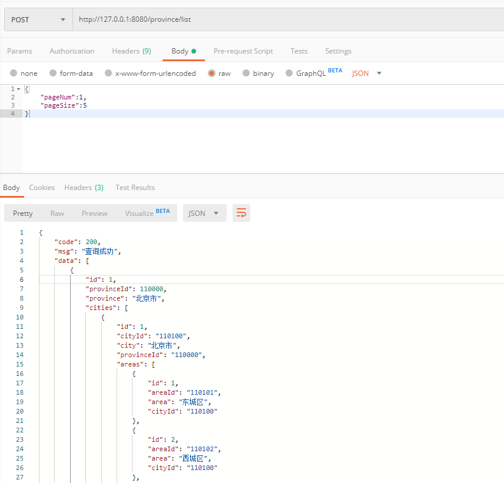

### province接口  

省市区是三级联动的，插入、修改使用同一接口，不存在则是添加，存在就是更新数据。

+ #### 1、添加（更新）province 

url:
```
http://127.0.0.1:8080/province/add
```
requestBody:
```
{
    "provinceId": "1001",
    "province": "sheng"
}
```
response:
```
{
    "code": 200,
    "msg": "添加成功",
    "data": true
}
```
Postman请求示例截图：  
  


+ #### 2、更新（添加）province  
数据库已存在相同provinceId的数据，则更新  

url:
```
http://127.0.0.1:8080/province/add
```
requestBody:
```
{
    "provinceId": "1001",
    "province": "**省"
}
```
response:
```
{
    "code": 200,
    "msg": "该Provinces已存在,更新成功",
    "data": true
}
```
Postman请求示例截图：  
  

+ #### 3、根据provinceId删除province  

url:
```
http://127.0.0.1:8080/province/del
```
requestBody:
```
{
    "provinceId": "1001"
}
```
response:
```
{
    "code": 200,
    "msg": "删除成功",
    "data": true
}
```
Postman请求示例截图：  
  

+ #### 4、根据provinceId获取province列表  

url:
```
http://127.0.0.1:8080/province/listById
```
requestBody:
```
{
	"provinceId":"110000"
}
```
response:
```
{
    "code": 200,
    "msg": "查询成功",
    "data": [
        {
            "id": 1,
            "provinceId": 110000,
            "province": "北京市"
        }
    ]
}
```  
Postman请求示例截图：  


+ #### 5、获取所有province列表  

url:
```
http://127.0.0.1:8080/province/list
```
requestBody:
```
{
	"pageNum":1,
	"pageSize":5
}
```
response:
```
{
    "code": 200,
    "msg": "查询成功",
    "data": [
        {
            "id": 1,
            "provinceId": 110000,
            "province": "北京市"
        },
        {
            "id": 2,
            "provinceId": 120000,
            "province": "天津市"
        },
        {
            "id": 3,
            "provinceId": 130000,
            "province": "河北省"
        },
        {
            "id": 4,
            "provinceId": 140000,
            "province": "山西省"
        },
        {
            "id": 5,
            "provinceId": 150000,
            "province": "内蒙古自治区"
        }
    ]
}
```  
Postman请求示例截图：  
