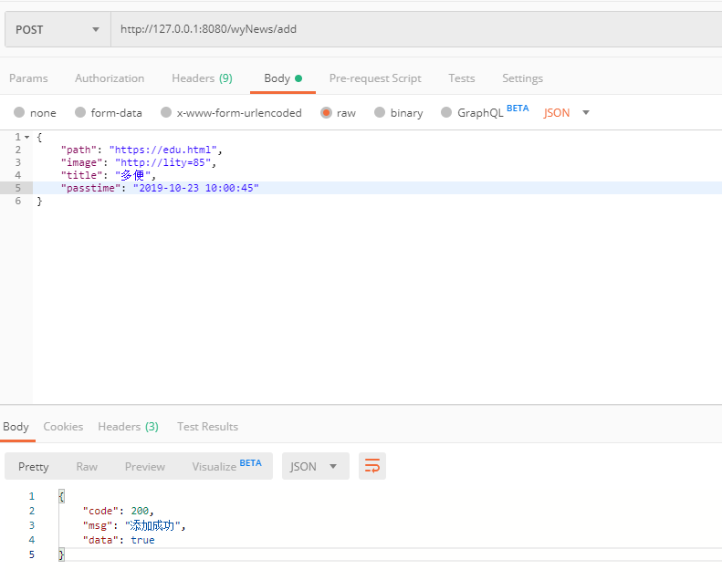
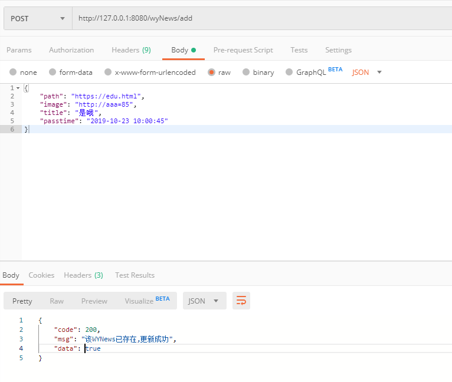
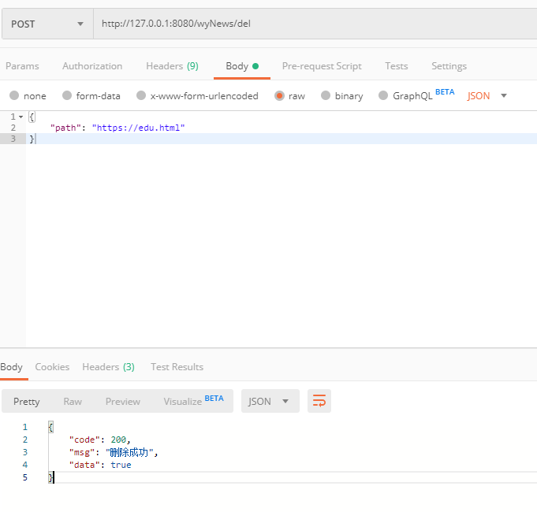
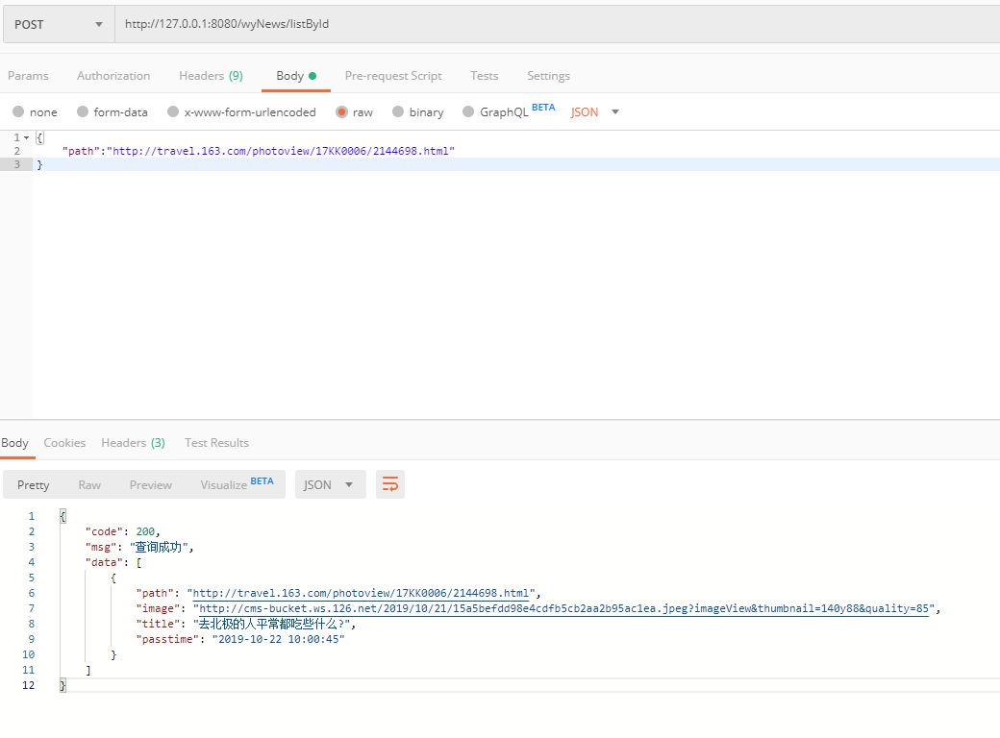

### wyNews接口  

插入、修改使用同一接口，不存在则是添加，存在就是更新数据。  
表中已添加了25条数据

+ #### 1、添加（更新）wyNews 

url:
```
http://127.0.0.1:8080/wyNews/add
```
requestBody:
```
{
    "path": "https://edu.html",
    "image": "http://lity=85",
    "title": "多便",
    "passtime": "2019-10-23 10:00:45"
}
```
response:
```
{
    "code": 200,
    "msg": "添加成功",
    "data": true
}
```
Postman请求示例截图：  
  


+ #### 2、更新（添加）wyNews  
数据库已存在相同wyNewsId的数据，则更新  

url:
```
http://127.0.0.1:8080/wyNews/add
```
requestBody:
```
{
    "path": "https://edu.html",
    "image": "http://aaa=85",
    "title": "是哦",
    "passtime": "2019-10-23 10:00:45"
}
```
response:
```
{
    "code": 200,
    "msg": "该WYNews已存在,更新成功",
    "data": true
}
```
Postman请求示例截图：  
  

+ #### 3、根据wyNewsId删除wyNews  

url:
```
http://127.0.0.1:8080/wyNews/del
```
requestBody:
```
{
    "path": "https://edu.html"
}
```
response:
```
{
    "code": 200,
    "msg": "删除成功",
    "data": true
}
```
Postman请求示例截图：  
  

+ #### 4、根据id获取wyNews列表  

url:
```
http://127.0.0.1:8080/wyNews/listById
```
requestBody:
```
{
    "path":"http://travel.163.com/photoview/17KK0006/2144698.html"
}
```
response:
```
{
    "code": 200,
    "msg": "查询成功",
    "data": [
        {
            "path": "http://travel.163.com/photoview/17KK0006/2144698.html",
            "image": "http://cms-bucket.ws.126.net/2019/10/21/15a5befdd98e4cdfb5cb2aa2b95ac1ea.jpeg?imageView&thumbnail=140y88&quality=85",
            "title": "去北极的人平常都吃些什么?",
            "passtime": "2019-10-22 10:00:45"
        }
    ]
}
```  
Postman请求示例截图：  


+ #### 5、获取所有wyNews列表  

url:
```
http://127.0.0.1:8080/wyNews/list
```
requestBody:
```
{
	"pageNum":1,
	"pageSize":5
}
```
response:
```
{
    "code": 200,
    "msg": "查询成功",
    "data": [
        {
            "path": "https://news.163.com/19/0308/05/E9NLBIT30001875O.html",
            "image": "http://cms-bucket.ws.126.net/2019/03/08/cdf92f27b0c54b59a7fa5a43789af2f6.png?imageView&thumbnail=140y88&quality=85",
            "title": "科恩起诉特朗普集团：拖欠我190万美元法律费用",
            "passtime": "2019-03-08 10:00:35"
        },
        {
            "path": "https://news.163.com/19/0308/05/E9NL6N950001875O.html",
            "image": "http://cms-bucket.ws.126.net/2019/03/08/d41c98c5380647d498d7750a252d6d50.png?imageView&thumbnail=140y88&quality=85",
            "title": "8项罪名被判成立 特朗普前竞选经理或在狱中度余生",
            "passtime": "2019-03-08 10:00:35"
        },
        {
            "path": "https://news.163.com/19/0308/04/E9NIC6FI000187R2.html",
            "image": "http://cms-bucket.ws.126.net/2019/03/08/4e847fe7b19a4c4491d070019bdb94b5.png?imageView&thumbnail=140y88&quality=85",
            "title": "外媒:洛马公司获多份合同 成美中俄导弹竞赛大赢家",
            "passtime": "2019-03-08 10:00:35"
        },
        {
            "path": "https://news.163.com/19/0308/04/E9NH2IH00001875P.html",
            "image": "http://cms-bucket.ws.126.net/2019/03/08/4349ab34f7ad47ca953846d238110412.png?imageView&thumbnail=140y88&quality=85",
            "title": "云南临沧市永德县发生4.4级地震 震源深度11千米",
            "passtime": "2019-03-08 10:00:35"
        },
        {
            "path": "https://news.163.com/19/0308/03/E9NESUVP0001875P.html",
            "image": "http://cms-bucket.ws.126.net/2019/03/08/24be838d8be944e18b063b57b914b707.png?imageView&thumbnail=140y88&quality=85",
            "title": "四川乐山共享单车堆满2亩农田 农田主:租金还没付",
            "passtime": "2019-03-08 10:00:35"
        }
    ]
}
```  
Postman请求示例截图：  
